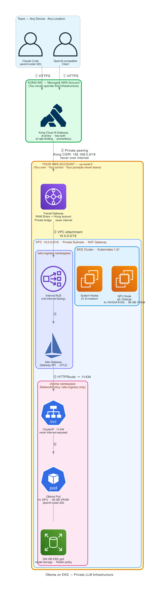

# Ollama on EKS - Terraform IaC

Deploy a fully private Ollama LLM server on AWS EKS with GPU acceleration, exposed via Kong Konnect Cloud AI Gateway for team-wide access. Your code and prompts travel encrypted through your own infrastructure — no third-party LLM provider is involved.

---

## Architecture



> To regenerate: `python3 generate-diagram.py` (requires `pip install diagrams` + `brew install graphviz`)

**Traffic flow:**
```
Client → Kong Cloud AI GW (Kong's AWS) --[Transit GW]--> Internal NLB --> Istio Gateway --> Ollama Pod
```

**What runs where:**

| Component | Where | Role |
|---|---|---|
| Claude Code | Your Mac | Agent framework — reads files, edits code, runs commands |
| Kong Cloud AI GW | Kong's AWS account (managed) | AI-aware API gateway — auth, rate limiting, LLM routing |
| Transit Gateway | Your AWS account | Private network bridge between Kong's VPC and yours |
| RAM Share | Your AWS account | Shares TGW with Kong's AWS account for cross-account attach |
| Internal NLB | Your AWS account (EKS) | Load balancer — only reachable via Transit Gateway |
| Istio Ambient Mesh | Your AWS account (EKS) | L4 mTLS, Gateway API routing |
| Ollama server | Your AWS account (EKS) | Model server — loads model, runs GPU inference |
| EBS gp3 (200GB) | Your AWS account (AZ-local) | Block storage — attaches to EC2 GPU node via Nitro NVMe hypervisor (not PrivateLink) |
| qwen3-coder:32b | Your AWS account (EKS) | The actual LLM brain doing the reasoning |

---

## Prerequisites

### 1. Install CLI Tools

```bash
brew install awscli terraform kubectl helm
brew install kong/deck/deck   # Kong declarative config tool
```

### 2. Configure AWS Credentials

```bash
aws configure
# Enter: AWS Access Key ID, Secret Key, Region (e.g., us-west-2), Output format (json)
```

Verify:

```bash
aws sts get-caller-identity
```

### 3. Kong Konnect Account

1. Sign up at [https://cloud.konghq.com](https://cloud.konghq.com)
2. Generate a Personal Access Token: Settings → Personal Access Tokens
3. Copy `.env.example` to `.env` and set your credentials:

```bash
cp .env.example .env
# Edit .env with your KONNECT_REGION and KONNECT_TOKEN
```

### 4. GPU Instance Quota

Ensure your AWS account has quota for GPU instances in your target region. Check at:
**AWS Console > Service Quotas > EC2 > Running On-Demand G and VT instances**

For `g5.12xlarge` you need at least 48 vCPUs. Request a quota increase if needed.

---

## Quick Start

### Step 1: Configure Credentials

```bash
cp .env.example .env
# Edit .env — set KONNECT_REGION and KONNECT_TOKEN (required for Kong team access)
# Leave blank to skip Kong and use local port-forward mode only
```

### Step 2: Deploy Everything

```bash
./deploy.sh
```

That's it. The script handles the full lifecycle end-to-end:
- `terraform init + apply` — VPC, EKS, IAM, ArgoCD bootstrap (~20 min)
- ArgoCD auto-syncs Istio, Ollama, and Gateway from Git (waves -2 to 6)
- Configures `kubectl` from Terraform outputs
- Waits for ArgoCD Wave 1 (namespaces)
- Generates TLS certificates (unblocks Wave 5 — Istio Gateway)
- Waits for Ollama to be ready
- Sets up Kong Konnect Cloud AI Gateway *(if `.env` credentials are set)*

> Already deployed? Re-run just the post-setup: `./scripts/01-setup.sh`

### Step 3: Verify and Connect

**Check the model has finished loading** (qwen3-coder:32b is ~20GB — may take 10–30 min):

```bash
kubectl logs -n ollama -l app=model-loader -f
# Wait for: pull completed

kubectl get applications -n argocd
# All should show: Synced / Healthy
```

**Connect Claude Code — with Kong (team access, recommended):**

```bash
# Get your proxy URL from Konnect UI:
# https://cloud.konghq.com → Gateway Manager → Data Plane Nodes
source claude-switch.sh ollama \
  --endpoint https://<KONG_PROXY_URL> \
  --apikey <your-api-key>

claude --model qwen3-coder:32b
```

**Connect Claude Code — without Kong (local port-forward, single user):**

```bash
source claude-switch.sh local
claude --model qwen3-coder:32b
```

### Step 4: Scale to Zero When Done (stop GPU billing)

```bash
kubectl scale deployment ollama -n ollama --replicas=0
```

The EBS volume (with all downloaded models) is preserved — next time just scale back up:

```bash
kubectl scale deployment ollama -n ollama --replicas=1
```

---

## Architecture Layers

### External: Kong Konnect Cloud AI Gateway (Kong's AWS account)

Kong is the external-facing entry point that sits on top of your 4-layer private infrastructure. It lives in Kong's managed AWS account and connects to yours via Transit Gateway.

| Component | Details |
|-----------|---------|
| Kong Cloud AI GW | Managed Kong in Kong's AWS — auth, rate limiting, LLM-aware routing |
| Transit Gateway | Terraform-provisioned bridge between Kong's VPC and your EKS VPC |
| RAM Share | Shares your TGW with Kong's AWS account for cross-account attachment |
| `ai-proxy` Plugin | Translates OpenAI format → Ollama API transparently |
| `key-auth` Plugin | API key auth per team member (consumer-level) |

Scripts that configure Kong: `scripts/03-setup-cloud-gateway.sh`, `scripts/04-post-setup.sh`

---

### Layer 1: Cloud Foundations (Terraform — `modules/vpc`)

| Resource | Details |
|----------|---------|
| VPC | `10.0.0.0/16` with DNS hostnames enabled |
| Public Subnets | 2x across AZs, auto-assign public IP, tagged for ELB |
| Private Subnets | 2x across AZs, tagged for internal ELB |
| Internet Gateway | Outbound internet for public subnets |
| NAT Gateway | Outbound internet for private subnets (single NAT) |
| Route Tables | Public routes via IGW, private routes via NAT |

### Layer 2: Kubernetes Infrastructure (Terraform — `modules/iam`, `modules/eks`, `modules/argocd`, `modules/lb-controller`)

| Resource | Details |
|----------|---------|
| IAM Roles | Cluster role, Node role, EBS CSI IRSA role, LB Controller IRSA role |
| EKS Cluster | Kubernetes 1.31, public + private API endpoint |
| OIDC Provider | Enables IRSA (IAM Roles for Service Accounts) |
| System Node Group | 2x `t3.medium`, tainted `CriticalAddonsOnly` |
| GPU Node Group | 1x `g5.12xlarge` (4x NVIDIA A10G, 96GB VRAM), tainted `nvidia.com/gpu` |
| EKS Addons | VPC-CNI, CoreDNS, kube-proxy, EBS CSI Driver |
| ArgoCD | Helm chart v7.7.16 — GitOps controller, watches `argocd/apps/` in this repo |
| AWS LB Controller | Helm release — provisions internal NLBs from Gateway API resources |
| Transit Gateway | Private network bridge to Kong's managed infrastructure (if `enable_kong = true`) |
| RAM Share | Shares TGW with Kong's AWS account for cross-account connectivity |
| VPC Routes + SG | Routes `192.168.0.0/16` via TGW, inbound SG rule for Kong CIDR |

### Layer 3: Kubernetes Customizations (ArgoCD — sync waves -2 to 2, 5, 6)

ArgoCD auto-deploys these from Git after `terraform apply`:

| Wave | What Gets Deployed | Source |
|------|--------------------|--------|
| -2 | Gateway API CRDs v1.2.0 | kubernetes-sigs/gateway-api |
| -1 | Istio Base CRDs | istio/base v1.24.2 |
| 0 | Istiod (ambient profile), Istio CNI, ztunnel, NVIDIA Device Plugin | Helm charts |
| 1 | `ollama` + `istio-ingress` namespaces with `istio.io/dataplane-mode: ambient` | `k8s/namespaces.yaml` |
| 2 | GP3 StorageClass (4000 IOPS) + 200Gi PVC | `k8s/ollama/` |
| 5 | Istio Gateway → internal NLB (needs TLS cert from `02-generate-certs.sh`) | `k8s/gateway.yaml` |
| 6 | HTTPRoutes → Ollama service | `k8s/httproutes.yaml` |

### Layer 4: Applications (ArgoCD — sync waves 3, 4)

| Wave | What Gets Deployed | Source |
|------|--------------------|--------|
| 3 | Ollama Deployment (4 GPUs, 96Gi), Service (ClusterIP :11434), NetworkPolicy | `k8s/ollama/` |
| 4 | Model Loader Job — pulls `qwen3-coder:32b` to EBS volume | `k8s/model-loader/` |

### Post-Terraform (automated by `deploy.sh`)

| Script | What It Does |
|--------|-------------|
| `scripts/01-setup.sh` | Master orchestrator — kubectl config, ArgoCD wait, TLS certs, Ollama wait, Kong setup |
| `scripts/02-generate-certs.sh` | Creates TLS secret; ArgoCD self-heals and Wave 5 (Gateway) becomes healthy |
| `scripts/03-setup-cloud-gateway.sh` | Creates Kong Konnect control plane + cloud gateway network + TGW attachment |
| `scripts/04-post-setup.sh` | Discovers NLB hostname, updates `deck/kong.yaml`, syncs AI Gateway config |

---

## Kong AI Gateway Features

The `deck/kong.yaml` configuration uses Kong's AI Gateway plugins:

| Plugin | Purpose |
|--------|---------|
| `ai-proxy` | LLM-aware routing — translates OpenAI format to Ollama API |
| `ai-rate-limiting-advanced` | Token-based rate limiting for LLM requests |
| `key-auth` | API key authentication per team member |
| `rate-limiting` | Request-based rate limiting for direct API access |
| `request-size-limiting` | Protects against oversized prompts (10MB limit) |
| `prometheus` | Per-consumer metrics and latency tracking |
| `cors` | Cross-origin support for web-based LLM clients |

### Routes

| Route | Path | Description |
|-------|------|-------------|
| AI Chat | `/ai/chat` | OpenAI-compatible chat completions via `ai-proxy` |
| AI Completions | `/ai/completions` | OpenAI-compatible text completions via `ai-proxy` |
| Ollama Direct | `/api/*`, `/v1/*` | Pass-through for Claude Code and native Ollama API |
| Health Check | `/healthz` | Kong Cloud Gateway health probe |

### Adding Team Members

Edit `deck/kong.yaml` to add consumers:

```yaml
consumers:
  - username: alice
    keyauth_credentials:
      - key: alice-secure-key-here
  - username: bob
    keyauth_credentials:
      - key: bob-secure-key-here
```

Then sync:

```bash
deck gateway sync deck/kong.yaml \
  --konnect-addr https://${KONNECT_REGION}.api.konghq.com \
  --konnect-token $KONNECT_TOKEN \
  --konnect-control-plane-name ollama-ai-gateway
```

---

## Using Claude Code

The `claude-switch.sh` script lets you switch between three modes:

### Mode 1: Remote (Anthropic API) — Default

```bash
source claude-switch.sh remote
claude
```

### Mode 2: Local (EKS via Port-Forward)

```bash
source claude-switch.sh local
claude --model qwen3-coder:32b
```

Starts `kubectl port-forward -n ollama svc/ollama 11434:11434` automatically in the background.

### Mode 3: Kong Cloud AI Gateway (Team Access) — Recommended

```bash
source claude-switch.sh ollama \
  --endpoint https://<KONG_PROXY_URL> \
  --apikey <your-api-key>

claude --model qwen3-coder:32b
```

### Check Current Mode

```bash
source claude-switch.sh status
```

### Switch Between Modes

```bash
source claude-switch.sh remote          # back to Anthropic API
source claude-switch.sh local           # port-forward
source claude-switch.sh ollama \        # Kong gateway
  --endpoint https://... --apikey ...
source claude-switch.sh status          # show current setup
```

---

## GPU Instance Options

Edit `terraform.tfvars` to change the GPU instance:

| Instance | GPUs | VRAM | Best For | Cost/hr |
|----------|------|------|----------|---------|
| `g5.xlarge` | 1x A10G | 24GB | 7B models | ~$1.01 |
| `g5.2xlarge` | 1x A10G | 24GB | 7B-14B models | ~$1.21 |
| `g5.12xlarge` | 4x A10G | 96GB | 32B-70B models | ~$5.67 |
| `p4d.24xlarge` | 8x A100 | 320GB | 70B+ models | ~$32.77 |

When changing instance type, update these variables together:

```hcl
gpu_node_instance_type = "g5.xlarge"
gpu_count              = 1
ollama_memory_limit    = "20Gi"
ollama_memory_request  = "16Gi"
ollama_cpu_limit       = 4
ollama_cpu_request     = 2
ollama_model           = "qwen3-coder:7b"
```

---

## Cost Management

### Monthly cost estimates

| Component | 24/7 | 8 hrs/day weekdays | 8 hrs/day Spot |
|-----------|------|--------------------|----------------|
| EKS Control Plane | ~$73 | ~$73 | ~$73 |
| g5.12xlarge | ~$4,082 | ~$907 | ~$304 |
| EBS 200GB gp3 | ~$18 | ~$18 | ~$18 |
| Kong Konnect Cloud GW | Varies | Varies | Varies |
| **Total** | **~$4,173+** | **~$998+** | **~$395+** |

### Scale to zero (stop GPU billing)

```bash
kubectl scale deployment ollama -n ollama --replicas=0

aws eks update-nodegroup-config \
  --cluster-name $(terraform -chdir=terraform output -raw eks_cluster_name) \
  --nodegroup-name $(terraform -chdir=terraform output -raw gpu_node_group_name) \
  --scaling-config minSize=0,maxSize=2,desiredSize=0 \
  --region $(terraform -chdir=terraform output -raw region)
```

### Resume next day

```bash
aws eks update-nodegroup-config \
  --cluster-name $(terraform -chdir=terraform output -raw eks_cluster_name) \
  --nodegroup-name $(terraform -chdir=terraform output -raw gpu_node_group_name) \
  --scaling-config minSize=0,maxSize=2,desiredSize=1 \
  --region $(terraform -chdir=terraform output -raw region)

kubectl scale deployment ollama -n ollama --replicas=1
kubectl wait --for=condition=ready pod -l app=ollama -n ollama --timeout=300s
# Models persist on EBS — no re-download needed!
```

---

## Security

| Layer | Protection |
|-------|-----------|
| **Kong AI Gateway** | API key auth per consumer, token-based rate limiting, request size limits |
| **Transit Gateway** | Private connectivity — Kong traffic never traverses the internet to reach EKS |
| **Internal NLB** | Not internet-facing — only reachable via Transit Gateway |
| **Istio Ambient** | Automatic mTLS between all pods (L4 encryption) |
| **Ollama Service** | `ClusterIP` — never exposed to internet |
| **NetworkPolicy** | Ingress: `istio-ingress` + `ollama` namespaces only. Egress: DNS + HTTPS |
| **AWS VPC** | Private subnets for nodes, NAT Gateway for outbound only |
| **Node Isolation** | System nodes tainted `CriticalAddonsOnly`, GPU nodes tainted `nvidia.com/gpu` |
| **EBS Storage** | gp3 volume attaches to EC2 GPU node via Nitro NVMe (hypervisor-level, not network) |
| **IRSA** | EBS CSI + LB Controller use scoped IAM roles via OIDC |

---

## File Structure

```
.
├── deploy.sh                     # Entry point — full stack deploy (terraform + post-setup)
├── destroy.sh                    # Entry point — complete teardown
├── claude-switch.sh              # Claude Code mode switcher (remote / local / kong)
├── .env.example                  # Kong Konnect credentials template
├── generate-diagram.py           # Regenerates docs/architecture.png
├── terraform/
│   ├── main.tf                   # Root module — orchestrates all layers
│   ├── variables.tf              # All input variables
│   ├── terraform.tfvars          # Default values
│   ├── outputs.tf                # Terraform outputs
│   ├── providers.tf              # AWS, Kubernetes, Helm providers
│   ├── README.md                 # Terraform-specific documentation
│   └── modules/
│       ├── vpc/                  # Layer 1: VPC, subnets, NAT
│       ├── iam/                  # Layer 2: IAM roles
│       ├── eks/                  # Layer 2: EKS cluster + node groups
│       ├── argocd/               # Layer 2: ArgoCD GitOps bootstrap
│       └── lb-controller/        # Layer 2: AWS LB Controller
├── argocd/
│   └── apps/                     # ArgoCD Application manifests (sync waves -2 to 6)
│       ├── 00-gateway-api-crds.yaml
│       ├── 01-istio-base.yaml
│       ├── 02-istiod.yaml
│       ├── 03-istio-cni.yaml
│       ├── 04-ztunnel.yaml
│       ├── 05-nvidia-device-plugin.yaml
│       ├── 06-namespaces.yaml
│       ├── 07-ollama-storage.yaml
│       ├── 08-ollama.yaml
│       ├── 09-model-loader.yaml
│       ├── 10-gateway.yaml
│       └── 11-httproutes.yaml
├── k8s/
│   ├── namespaces.yaml           # ollama + istio-ingress namespaces (ambient mode)
│   ├── gateway.yaml              # Istio Gateway (internal NLB)
│   ├── httproutes.yaml           # HTTPRoutes for Ollama
│   ├── ollama/                   # Deployment, Service, NetworkPolicy, StorageClass, PVC
│   └── model-loader/             # Job: pulls qwen3-coder:32b to EBS volume
├── scripts/
│   ├── 01-setup.sh               # Post-terraform orchestrator (called by deploy.sh)
│   ├── 02-generate-certs.sh      # TLS certificates for Istio Gateway
│   ├── 03-setup-cloud-gateway.sh # Kong Konnect Cloud Gateway setup
│   └── 04-post-setup.sh          # Discover NLB + sync Kong config
├── deck/
│   └── kong.yaml                 # Kong AI Gateway declarative config
└── docs/
    └── architecture.png          # Architecture diagram
```

---

## Troubleshooting

| Problem | Diagnosis | Fix |
|---------|-----------|-----|
| Pod stuck in `Pending` | `kubectl describe pod -n ollama -l app=ollama` | GPU node not ready — wait or check nodegroup |
| `Insufficient nvidia.com/gpu` | NVIDIA plugin not ready | Wait for DaemonSet: `kubectl get ds -n kube-system` |
| Model pull fails | `kubectl exec -n ollama deploy/ollama -- df -h /root/.ollama` | Disk full — increase `model_storage_size` |
| Kong returns 401 | Missing or wrong API key | Check `apikey` header matches `deck/kong.yaml` consumer |
| Kong returns 429 | Rate limit exceeded | Wait or increase `minute` limit in `deck/kong.yaml` |
| NLB not provisioning | `kubectl get gateway -n istio-ingress` | Check LB Controller: `kubectl logs -n kube-system -l app.kubernetes.io/name=aws-load-balancer-controller` |
| TGW attachment pending | Check Konnect UI → Cloud Gateways | Network provisioning takes ~30 min |
| Istio pods not ready | `kubectl get pods -n istio-system` | Check ArgoCD app: `kubectl get application -n argocd` — ArgoCD self-heals automatically |
| ArgoCD app stuck | `kubectl get applications -n argocd` | Check sync status: `kubectl describe application <name> -n argocd` |
| Port-forward drops | Connection timeout | Use Kong mode instead, or loop: `while true; do kubectl port-forward ...; sleep 2; done` |
| Claude Code outputs raw JSON | Model too small | Use 32B+ model |
| GPU quota exceeded | AWS `InsufficientInstanceCapacity` | Request quota increase in AWS Console |
| Kong 409 on re-run | Control plane or network already exists | Script is idempotent — it will reuse existing resources automatically |

### Useful debugging commands

**ArgoCD**
```bash
# Check all apps and sync status
kubectl get applications -n argocd
kubectl describe application ollama-root -n argocd

# ArgoCD UI (run in a separate terminal, then open https://localhost:8080)
kubectl port-forward svc/argocd-server -n argocd 8080:443
# Password:
kubectl -n argocd get secret argocd-initial-admin-secret \
  -o jsonpath='{.data.password}' | base64 -d
```

**Ollama**
```bash
# Check all pods
kubectl get pods -A

# Ollama pod status
kubectl get pods -n ollama

# Model loader — wait for "pull completed"
kubectl logs -n ollama -l app=model-loader -f

# Ollama server logs
kubectl logs -n ollama deploy/ollama -f

# GPU status
kubectl exec -n ollama deploy/ollama -- nvidia-smi
```

**Istio + Gateway**
```bash
kubectl get pods -n istio-system
kubectl get pods -n istio-ingress
kubectl get gateway -n istio-ingress
kubectl logs -n kube-system -l app.kubernetes.io/name=aws-load-balancer-controller
```

**Kong Konnect — check control planes and network state**
```bash
source .env

# List control planes
curl -s "https://${KONNECT_REGION}.api.konghq.com/v2/control-planes" \
  -H "Authorization: Bearer $KONNECT_TOKEN" | \
  jq '.data[] | {name, id, cloud_gateway}'

# Poll cloud gateway network state (initializing → ready, takes ~30 min)
while true; do
  STATE=$(curl -s "https://global.api.konghq.com/v2/cloud-gateways/networks" \
    -H "Authorization: Bearer ${KONNECT_TOKEN}" | \
    jq -r '.data[] | select(.name == "ollama-eks-network") | .state' 2>/dev/null)
  echo "[$(date '+%H:%M:%S')] ollama-eks-network: ${STATE:-unknown}"
  [[ "$STATE" == "ready" ]] && echo "Ready — run ./scripts/04-post-setup.sh" && break
  sleep 30
done

# Kong config diff (before sync)
deck gateway diff deck/kong.yaml \
  --konnect-addr https://${KONNECT_REGION}.api.konghq.com \
  --konnect-token $KONNECT_TOKEN \
  --konnect-control-plane-name kong-cloud-gateway-eks
```

**Kong Konnect — get the full connect command**

Step 1 — Get your Kong proxy URL:
```bash
source .env

# Get the control plane ID
CP_ID=$(curl -s "https://${KONNECT_REGION}.api.konghq.com/v2/control-planes" \
  -H "Authorization: Bearer $KONNECT_TOKEN" | \
  jq -r '.data[] | select(.name == "kong-cloud-gateway-eks") | .id')

# Get the proxy URL (printed after network reaches "ready")
KONG_PROXY_URL=$(curl -s \
  "https://global.api.konghq.com/v2/cloud-gateways/configurations?control_plane_id=${CP_ID}" \
  -H "Authorization: Bearer $KONNECT_TOKEN" | \
  jq -r '.data[].dataplane_groups[].dns' | head -1)

echo "Kong proxy URL: https://${KONG_PROXY_URL}"
```

Step 2 — API keys are defined in `deck/kong.yaml` under `consumers:`:
```yaml
consumers:
  - username: team-admin
    keyauth_credentials:
      - key: change-me-admin-key-do-not-use-in-production   # ← change this
  - username: team-dev
    keyauth_credentials:
      - key: change-me-dev-key-do-not-use-in-production     # ← change this
```

Update the keys, then sync to Konnect:
```bash
deck gateway sync deck/kong.yaml \
  --konnect-addr https://${KONNECT_REGION}.api.konghq.com \
  --konnect-token $KONNECT_TOKEN \
  --konnect-control-plane-name kong-cloud-gateway-eks
```

Step 3 — Connect Claude Code (replace with your values from Steps 1 & 2):
```bash
source claude-switch.sh ollama \
  --endpoint https://${KONG_PROXY_URL} \
  --apikey <your-api-key-from-deck/kong.yaml>

claude --model qwen3-coder:32b
```

Test connectivity before launching Claude Code:
```bash
curl -s "https://${KONG_PROXY_URL}/api/tags" \
  -H "apikey: <your-api-key>" | jq '.models[].name'
# Should list: qwen3-coder:32b
```

---

## Tear Down

```bash
./destroy.sh
```

This script automatically:
1. Removes Kong Konnect control plane via API
2. Deletes all ArgoCD Applications (cascades to Istio, Ollama, Gateway)
3. Waits for the internal NLB to be deleted (prevents VPC destroy failure)
4. Uninstalls ArgoCD Helm releases
5. Deletes namespaces (`istio-system`, `istio-ingress`, `ollama`, `argocd`)
6. Removes the EBS CSI Driver addon
7. Runs `terraform destroy`
8. Reports any orphaned EBS volumes (retained by policy — delete manually if not needed)

```bash
./destroy.sh --force   # skip confirmation prompt
```

---

## More Information

- **Terraform-specific docs:** See [terraform/README.md](terraform/README.md) for detailed Terraform configuration, variables, and outputs
- **GitHub:** [shanaka-versent/Ollama-on-EKS](https://github.com/shanaka-versent/Ollama-on-EKS)
