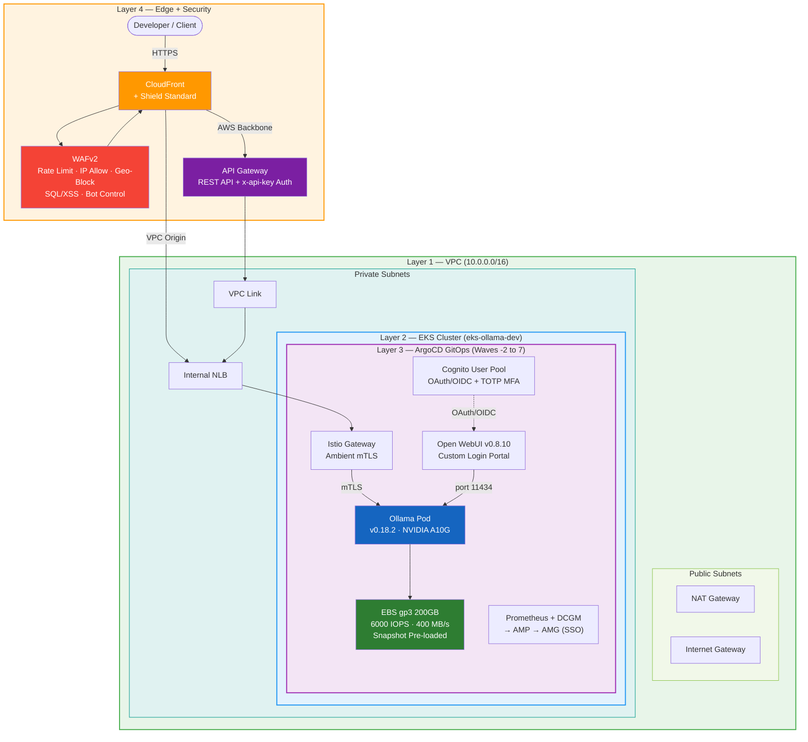
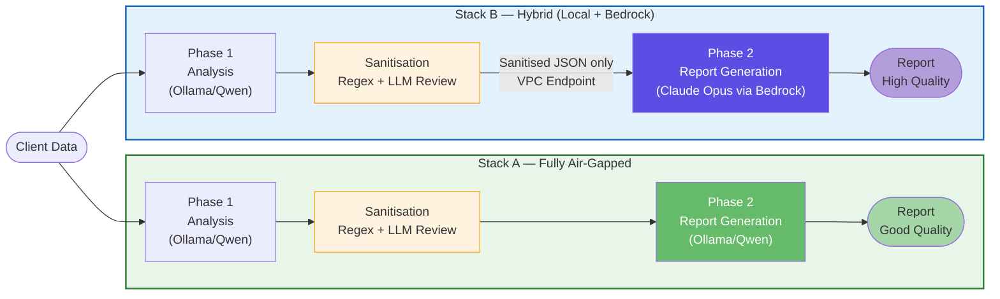
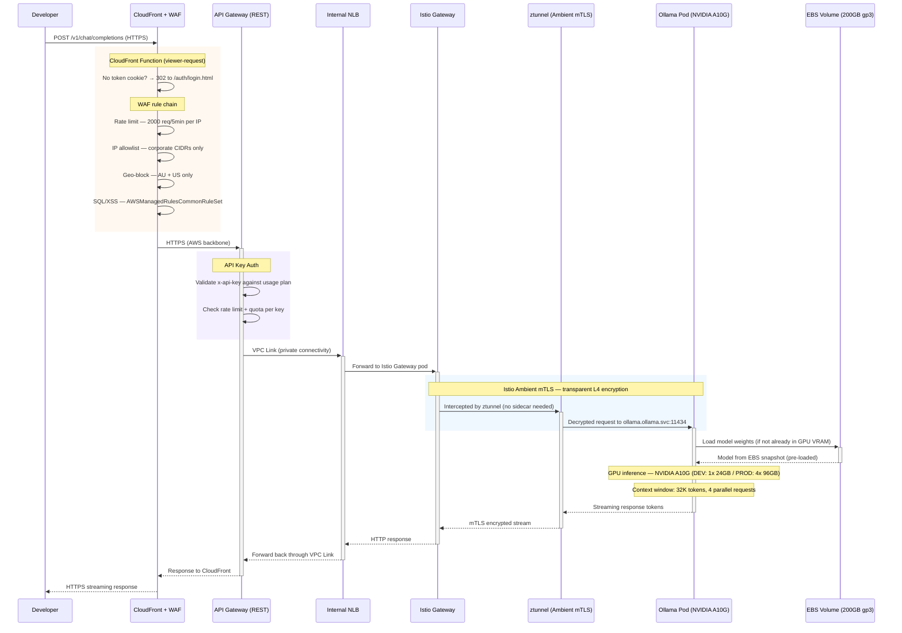

# Ollama on EKS

Deploy a fully private, air-gapped Ollama LLM server on AWS EKS with GPU acceleration, exposed via CloudFront + WAF + API Gateway. Your code and prompts never leave your AWS account — no third-party LLM provider sees your data.

---

## Architecture

### High-Level Architecture


```mermaid
flowchart TB
    subgraph L4["Layer 4 — Edge + Security"]
        Client([Developer / Client])
        CF["CloudFront\n+ Shield Standard"]
        WAF["WAFv2\nRate Limit · IP Allow · Geo-Block\nSQL/XSS · Bot Control"]
        APIGW["API Gateway\nREST API + x-api-key Auth"]
    end

    subgraph L1["Layer 1 — VPC (10.0.0.0/16)"]
        direction TB
        subgraph pub["Public Subnets"]
            NAT["NAT Gateway"]
            IGW["Internet Gateway"]
        end

        subgraph priv["Private Subnets"]
            VPCL["VPC Link"]
            NLB["Internal NLB"]

            subgraph L2["Layer 2 — EKS Cluster (eks-ollama-dev)"]
                direction TB
                subgraph L3["Layer 3 — ArgoCD GitOps (Waves -2 to 7)"]
                    direction LR
                    ISTIO["Istio Gateway\nAmbient mTLS"]
                    OLLAMA["Ollama Pod\nv0.18.2 · NVIDIA A10G"]
                    EBS["EBS gp3 200GB\n6000 IOPS · 400 MB/s\nSnapshot Pre-loaded"]
                    WEBUI["Open WebUI v0.8.10\nCustom Login Portal"]
                    COG["Cognito User Pool\nOAuth/OIDC + TOTP MFA"]
                    MON["Prometheus + DCGM\n→ AMP → AMG (SSO)"]
                end
            end
        end
    end

    Client -->|HTTPS| CF
    CF --> WAF
    WAF --> CF
    CF -->|VPC Origin| NLB
    CF -->|AWS Backbone| APIGW
    APIGW --> VPCL
    VPCL --> NLB
    NLB --> ISTIO
    ISTIO -->|mTLS| OLLAMA
    OLLAMA --> EBS
    WEBUI -->|port 11434| OLLAMA
    COG -.->|OAuth/OIDC| WEBUI

    style L4 fill:#fff3e0,stroke:#ff9800,stroke-width:2px
    style L1 fill:#e8f5e9,stroke:#4caf50,stroke-width:2px
    style L2 fill:#e3f2fd,stroke:#2196f3,stroke-width:2px
    style L3 fill:#f3e5f5,stroke:#9c27b0,stroke-width:2px
    style pub fill:#f1f8e9,stroke:#8bc34a
    style priv fill:#e0f2f1,stroke:#009688
    style CF fill:#ff9800,color:#fff
    style WAF fill:#f44336,color:#fff
    style APIGW fill:#7b1fa2,color:#fff
    style OLLAMA fill:#1565c0,color:#fff
    style EBS fill:#2e7d32,color:#fff
```

**Traffic flows:**
```
API:     Client → CloudFront (WAF) → API Gateway (x-api-key) → VPC Link → Internal NLB → Istio → Ollama
Web UI:  Client → CloudFront (WAF) → VPC Origin (private) → Internal NLB → Istio → Open WebUI
Login:   Client → CloudFront → /auth/login.html (S3) → Custom Portal → Cognito API → OAuth → Open WebUI
Grafana: Admin → AWS Managed Grafana (AMG) URL → IAM Identity Center SSO
```

CloudFront connects to the internal NLB via **VPC Origins** — private connectivity, no internet-facing load balancer needed. All traffic stays on the AWS backbone.

### Architecture (4 Layers)

| Layer | What | Components |
|-------|------|------------|
| 1 — Cloud Foundations | VPC (10.0.0.0/16) | Private/public subnets, NAT Gateway, Internet Gateway |
| 2 — EKS Cluster | Kubernetes + GPU | EKS Control Plane (Auto Mode), custom Karpenter NodePools: system (t3.xlarge on-demand) + GPU (g5.xlarge DEV / g5.12xlarge PROD spot), EBS CSI Driver, LB Controller |
| 3 — GitOps | ArgoCD waves -2 to 7 | Wave -2: Gateway API CRDs → Wave -1: Istio Base → Wave 0: Istiod + CNI + ztunnel → Wave 1: Namespaces + NodePools → Wave 2: Storage + KEDA → Waves 3-4: Ollama + Model Loader + KEDA ScaledObject → Waves 5-6: Gateway + Routes → Wave 7: Open WebUI |
| 4 — Edge + Security | CloudFront + WAF + API GW | CloudFront (+ WAF + Shield Standard) → API Gateway (REST API, x-api-key) → VPC Link → Internal NLB → Istio Gateway (mTLS) → Ollama Pod |

| Component | Where | Role |
|-----------|-------|------|
| CloudFront + WAF | AWS edge | DDoS protection, rate limiting, IP allowlist, geo-blocking |
| API Gateway (REST API) | Your AWS account | REST API with native API key auth, VPC Link to private NLB |
| Internal NLB | Your EKS VPC | Only reachable via VPC Link and VPC Origin — not internet-facing |
| Istio Ambient Mesh | Your EKS cluster | L4 mTLS between pods, Gateway API routing |
| Ollama server | Your EKS GPU node | Model server — runs GPU inference |
| EBS gp3 (200GB) | Your AWS account | Pre-loaded models via EBS snapshot, 6000 IOPS, 400 MB/s |
| Custom Login Portal | S3 + Lambda + API GW | Handles all auth flows (login, signup, MFA, password reset) — no Cognito hosted UI |
| Cognito User Pool | Your AWS account | OAuth/OIDC provider with TOTP MFA, group-based roles, admin-approved signups |

### Default Model: Fallback (qwen3.5:27b) — DEV Phase

**Current phase: DEV** — using Tier 1 fallback (`qwen3.5:27b`) on g5.xlarge (1x A10G, $0.35/hr spot) for infrastructure testing and platform validation.

**PROD upgrade:** When ready for production, switch to Tier 3 flagship. Two changes:

1. **Terraform:** `terraform apply -var-file=environments/prod.tfvars`
2. **ArgoCD:** Change `path` in 4 app files from `k8s/overlays/dev/...` to `k8s/overlays/prod/...` (nodepools, ollama, model-loader, open-webui)

Three tiers available, all pre-downloaded to EBS via snapshot:

| Tier | Model | GPU | Spot Cost | When to Use |
|------|-------|-----|-----------|-------------|
| **1 (Current)** | **`qwen3.5:27b`** | **g5.xlarge (1x A10G)** | **$0.35/hr** | **DEV — platform testing, monitoring setup** |
| 2 (Code) | `qwen3-coder:30b-a3b` | g5.xlarge (1x A10G) | $0.35/hr | Pure coding tasks, very fast MoE inference |
| 3 (Flagship) | `qwen3.5:122b-a10b` | g5.12xlarge (4x A10G) | $1.90/hr | PROD — maximum quality |

Switch tiers using the `/model` command in Claude Code, or directly via:

```bash
./switch-model.sh use 3   # flagship (default)
./switch-model.sh use 1   # fallback
./switch-model.sh use 2   # code-optimised
```

### Environment Configuration

Environment-specific values (GPU instance sizes, model names, resource limits) are managed via:

- **Terraform:** `terraform apply -var-file=environments/dev.tfvars` (or `prod.tfvars`)
- **K8s manifests:** Kustomize overlays in `k8s/overlays/dev/` and `k8s/overlays/prod/`
- **ArgoCD:** Application files point to `k8s/overlays/{env}/` paths

To switch from DEV to PROD: update the 4 ArgoCD app paths and run Terraform with the prod tfvars. No file editing or uncommenting required.

### Key Design Decisions

| Decision | Rationale |
|----------|-----------|
| CloudFront + WAF + API Gateway (not Kong) | 99% cost reduction ($756/mo → $6/mo), adds DDoS protection, eliminates Transit Gateway dependency |
| EKS Auto Mode + Custom NodePools | Built-in pools disabled (`node_pools = []`). Two custom Karpenter NodePools: system (t3.xlarge on-demand, `WhenEmptyOrUnderutilized` 5m) and GPU (g5 spot, `WhenEmpty` 30m). System on-demand because CoreDNS/Istio/Prometheus cannot tolerate spot interruptions. AWS manages NVIDIA device plugin and drivers |
| KEDA auto-scale-to-zero | KEDA **only targets the Ollama deployment** (GPU workload). After 15 min idle, scales Ollama to 0. Karpenter terminates empty GPU node after 10 min. Total idle-to-zero: ~25 min. Open WebUI stays at 1 replica on system nodes (never scaled to zero). Manual scale-up via `scripts/scale-up.sh` |
| EBS snapshots for model weights | Pre-loaded models on disk, no internet needed for model loading (air-gap compliant), cold start ~3 min instead of 15-25 min |
| High-throughput gp3 (400 MB/s + 6000 IOPS) | Fast model loading from snapshot — critical for reasonable cold start times |
| AWS Managed Grafana (AMG) | Prometheus + DCGM Exporter in-cluster → AMP → AMG (SSO via IAM Identity Center). All dashboards including FinOps |
| Spot with on-demand fallback | Karpenter tries spot first (~65% savings), auto-falls back to on-demand if reclaimed |
| Dual-mode pipeline | Two separate stacks (not config flag) — compliance by design, eliminates human error risk |
| Ollama image pinned to v0.18.2 | Reproducible builds, no surprise breaking changes from `:latest` |
| Custom login portal + Cognito | All auth flows (login, signup, MFA, password reset) handled by custom portal — users never see Cognito hosted UI. Cognito provides OAuth/OIDC backend with TOTP MFA and group-based roles |
| cert-manager (not manual openssl) | Automated TLS lifecycle — 90d duration, 30d auto-renewal, no manual cert rotation |
| Environment-based configuration (Terraform tfvars + Kustomize overlays) | DEV and PROD configs (instance types, models, resources) defined separately. No manual file editing or comment-toggling. Switch via `terraform apply -var-file=environments/prod.tfvars` + ArgoCD path update |

### Dual-Mode Pipeline — Two Separate Stacks

Two separate deployment stacks — deploy one or the other per engagement. Separate stacks ensure compliance by design and eliminate human error risk.

| | Stack A (Fully Air-Gapped) | Stack B (Hybrid — Local + Bedrock) |
|---|---|---|
| Phase 1 (Analysis) | Local Ollama/Qwen | Local Ollama/Qwen |
| Phase 2 (Report Gen) | Local Ollama/Qwen | Latest Claude Opus via AWS Bedrock |
| Sanitisation | Yes — regex + LLM review | Yes — regex + LLM review |
| Internet Egress | None | Bedrock VPC endpoint only |
| Best For | Defence, healthcare, government | Client-approved cloud access |

Stack A physically cannot reach Bedrock — no credentials, no egress rules, no API client.

**Data flow:**
- **Stack A:** Client Data → Phase 1 (Ollama/Qwen) → Sanitisation → Phase 2 (Ollama/Qwen) → Good quality report
- **Stack B:** Client Data → Phase 1 (Ollama/Qwen) → Sanitisation → Phase 2 (Latest Claude Opus via Bedrock, sanitised findings only) → High quality report


```mermaid
flowchart LR
    CD([Client Data])

    subgraph StackA["Stack A — Fully Air-Gapped"]
        direction LR
        A1["Phase 1\nAnalysis\n(Ollama/Qwen)"]
        AS["Sanitisation\nRegex + LLM Review"]
        A2["Phase 2\nReport Generation\n(Ollama/Qwen)"]
        AR([Report\nGood Quality])
    end

    subgraph StackB["Stack B — Hybrid (Local + Bedrock)"]
        direction LR
        B1["Phase 1\nAnalysis\n(Ollama/Qwen)"]
        BS["Sanitisation\nRegex + LLM Review"]
        B2["Phase 2\nReport Generation\n(Claude Opus via Bedrock)"]
        BR([Report\nHigh Quality])
    end

    CD --> A1
    A1 --> AS
    AS --> A2
    A2 --> AR

    CD --> B1
    B1 --> BS
    BS -->|Sanitised JSON only\nVPC Endpoint| B2
    B2 --> BR

    style StackA fill:#e8f5e9,stroke:#2e7d32,stroke-width:2px
    style StackB fill:#e3f2fd,stroke:#1565c0,stroke-width:2px
    style AS fill:#fff3e0,stroke:#ff9800
    style BS fill:#fff3e0,stroke:#ff9800
    style A2 fill:#66bb6a,color:#fff
    style B2 fill:#5c4ee5,color:#fff
    style AR fill:#a5d6a7
    style BR fill:#b39ddb
```

Deploy Stack B with: `terraform apply -var="enable_bedrock=true"`

#### Stack B — Bedrock Integration Details

Stack B adds these AWS resources (created by `terraform/modules/bedrock-integration/`):

| Resource | Details |
|----------|---------|
| VPC Endpoint | `com.amazonaws.ap-southeast-2.bedrock-runtime`, Interface type, private subnets, private DNS enabled |
| IRSA Role | `ollama-orchestrator-bedrock` — service account: `orchestrator:orchestrator-sa` |
| IAM Policy | `bedrock:InvokeModel` + `bedrock:InvokeModelWithResponseStream` on `anthropic.claude-*` |
| NetworkPolicy | Orchestrator namespace: egress to Bedrock VPC endpoint only (Stack A blocks all egress) |
| Sanitisation | Two-pass: (1) regex strips IPs, emails, API keys, ARNs, JWTs, SSH keys, connection strings; (2) local Qwen reviews for semantic leakage. Hard stop if raw data detected |

> The orchestrator is a separate product built on top of the Ollama-on-EKS infrastructure — separate repo, Dockerfile, and CI.

### Request Sequence


```mermaid
sequenceDiagram
    participant Dev as Developer
    participant CF as CloudFront + WAF
    participant APIGW as API Gateway (REST)
    participant NLB as Internal NLB
    participant IGW as Istio Gateway
    participant ZT as ztunnel (Ambient mTLS)
    participant OLM as Ollama Pod (NVIDIA A10G)
    participant EBS as EBS Volume (200GB gp3)

    Dev->>CF: POST /v1/chat/completions (HTTPS)

    rect rgb(255, 248, 240)
        Note over CF: CloudFront Function (viewer-request)
        CF->>CF: No token cookie? → 302 to /auth/login.html
        Note over CF: WAF rule chain
        CF->>CF: Rate limit — 2000 req/5min per IP
        CF->>CF: IP allowlist — corporate CIDRs only
        CF->>CF: Geo-block — AU + US only
        CF->>CF: SQL/XSS — AWSManagedRulesCommonRuleSet
    end

    CF->>+APIGW: HTTPS (AWS backbone)

    rect rgb(245, 240, 255)
        Note over APIGW: API Key Auth
        APIGW->>APIGW: Validate x-api-key against usage plan
        APIGW->>APIGW: Check rate limit + quota per key
    end

    APIGW->>+NLB: VPC Link (private connectivity)
    NLB->>+IGW: Forward to Istio Gateway pod

    rect rgb(240, 248, 255)
        Note over IGW,OLM: Istio Ambient mTLS — transparent L4 encryption
        IGW->>+ZT: Intercepted by ztunnel (no sidecar needed)
        ZT->>+OLM: Decrypted request to ollama.ollama.svc:11434
    end

    OLM->>+EBS: Load model weights (if not already in GPU VRAM)
    EBS-->>-OLM: Model from EBS snapshot (pre-loaded)

    Note over OLM: GPU inference — NVIDIA A10G (DEV: 1x 24GB / PROD: 4x 96GB)
    Note over OLM: Context window: 32K tokens, 4 parallel requests

    OLM-->>-ZT: Streaming response tokens
    ZT-->>-IGW: mTLS encrypted stream
    IGW-->>-NLB: HTTP response
    NLB-->>-APIGW: Forward back through VPC Link
    APIGW-->>-CF: Response to CloudFront
    CF-->>Dev: HTTPS streaming response
```

---

## Prerequisites

### 1. CLI Tools

```bash
brew install awscli terraform kubectl helm
```

### 2. AWS Credentials

```bash
aws configure
# Enter: Access Key ID, Secret Key, Region (ap-southeast-2), Output format (json)

aws sts get-caller-identity   # verify
```

### 3. GPU Instance Quota

Default GPU quotas are **0 vCPUs** in most accounts. You must request an increase before deploying:

| Quota | Code | DEV (g5.xlarge) | PROD (g5.12xlarge) | Recommended |
|-------|------|-----------------|-------------------|-------------|
| All G and VT Spot Instance Requests | `L-3819A6DF` | 4 vCPUs | 48 vCPUs | 64 vCPUs |
| Running On-Demand G and VT instances | `L-DB2E81BA` | 4 vCPUs | 48 vCPUs | 64 vCPUs |

Request via CLI: `aws service-quotas request-service-quota-increase --service-code ec2 --quota-code L-3819A6DF --desired-value 64 --region ap-southeast-2`. Approval typically takes 1-3 business days.

### 4. S3 Backend Bootstrap

Before running Terraform, create the state backend:

```bash
# Create S3 bucket (replace <ACCOUNT_ID> with your AWS account ID)
aws s3api create-bucket \
  --bucket ollama-eks-tfstate-<ACCOUNT_ID> \
  --region ap-southeast-2 \
  --create-bucket-configuration LocationConstraint=ap-southeast-2

aws s3api put-bucket-versioning \
  --bucket ollama-eks-tfstate-<ACCOUNT_ID> \
  --versioning-configuration Status=Enabled

# Create DynamoDB lock table
aws dynamodb create-table \
  --table-name ollama-eks-tfstate-lock \
  --attribute-definitions AttributeName=LockID,AttributeType=S \
  --key-schema AttributeName=LockID,KeyType=HASH \
  --billing-mode PAY_PER_REQUEST \
  --region ap-southeast-2
```

---

## Quick Start

The deployment has two phases. Complete each verification before moving on.

---

### Phase 1 — Deploy Infrastructure (~20–30 min)

**Option A: Automated deployment (recommended)**

```bash
./scripts/deploy-stack-a.sh
```

This single script handles everything: validates prerequisites, bootstraps the S3 backend, runs `terraform plan` + `apply`, configures `kubectl`, waits for ArgoCD waves to sync, and runs air-gap verification.

**Option B: Manual step-by-step**

```bash
cd terraform
terraform init
terraform plan
terraform apply
```

This provisions VPC, EKS, IAM, LB Controller, API Gateway, CloudFront + WAF, cert-manager, ArgoCD, and observability. ArgoCD then auto-deploys all Kubernetes workloads in sync wave order.

**Step 2: Create EBS model snapshot (first time only)**

```bash
./scripts/create-model-snapshot.sh
```

This launches a temporary GPU instance, pulls all 3 model tiers, snapshots the volume, and terminates the instance. Model weights are attached via PersistentVolume backed by the EBS snapshot.

**Verify before continuing:**

```bash
# All ArgoCD apps should be Synced / Healthy
kubectl get applications -n argocd

# Ollama pod should be Running
kubectl get pods -n ollama

# Run air-gap verification
./scripts/verify-airgap.sh
```

---

### Phase 2 — Connect (~5 min)

**Step 3: Get your API key**

```bash
# Retrieve the auto-generated API key from API Gateway
API_KEY_ID=$(terraform -chdir=terraform output -raw api_key_id)
API_KEY=$(aws apigateway get-api-key \
  --api-key $API_KEY_ID \
  --include-value --query value --output text)
echo $API_KEY

# Or view it in the Console: API Gateway → API Keys
```

**Step 4: Verify end-to-end via CloudFront**

```bash
# Get CloudFront domain from Terraform outputs
CLOUDFRONT_DOMAIN=$(terraform -chdir=terraform output -raw cloudfront_domain)

# Should return model list (requires API key)
curl -s "https://${CLOUDFRONT_DOMAIN}/api/tags" \
  -H "x-api-key: ${API_KEY}" | jq '.models[].name'

# Test chat completions
curl -s "https://${CLOUDFRONT_DOMAIN}/v1/chat/completions" \
  -H "Content-Type: application/json" \
  -H "x-api-key: ${API_KEY}" \
  -d '{"model":"qwen3.5:27b","messages":[{"role":"user","content":"Hello"}]}'
```

**Step 5: Connect clients**

```bash
# OpenAI SDK / Continue.dev / Open WebUI — API key maps to OPENAI_API_KEY
export OPENAI_API_BASE=https://${CLOUDFRONT_DOMAIN}
export OPENAI_API_KEY=${API_KEY}

# Or via kubectl port-forward (direct, no API key needed)
kubectl port-forward -n ollama svc/ollama 11434:11434
```

---

## Day-to-Day Usage

### Model Tier Switching

Use the `/model` command in Claude Code for an interactive picker, or specify directly:

```bash
/model              # interactive — shows tiers and asks which one
/model 3            # switch to flagship immediately
/model fallback     # switch to Tier 1
/model coder        # switch to Tier 2

# Or via shell script directly:
./switch-model.sh use 3
```

### Open WebUI (Browser-Based Chat Interface)

Open WebUI (v0.8.10) provides a ChatGPT-like interface for Ollama. Deployed on EKS system nodes (no GPU needed), air-gapped via NetworkPolicy. Accessible via CloudFront — no port-forwarding needed.

**Authentication:** All login is handled by a **custom login portal** (auth_proxy Lambda + login.html SPA) backed by **AWS Cognito** (OAuth/OIDC). Users **never** see the Cognito hosted UI. Local login and password management are completely disabled (`ENABLE_PASSWORD_AUTH=false`). Users authenticate via the custom portal with **mandatory TOTP MFA** (authenticator app). Roles are synced from Cognito groups on every login (`ENABLE_OAUTH_ROLE_MANAGEMENT=true`) — Cognito is the source of truth, any local role changes are overwritten on next login.

**Password changes:** A banner in Open WebUI links to the custom login portal at `/auth/login.html`. Users click "Forgot password?", receive a verification code via email, and set a new password — all within the custom portal (no Cognito hosted UI).

**Access URL:** `https://<CLOUDFRONT_DOMAIN>` — dynamically injected from Terraform output. The CloudFront domain is stored in the `webui-oauth-cognito` K8s secret, and Open WebUI reads it via `$(CLOUDFRONT_DOMAIN)` env var substitution (no hardcoded URLs in deployment YAML)

**Auto-redirect:** A CloudFront Function intercepts all viewer requests at the edge. Unauthenticated users (no `token` cookie) are automatically redirected to the custom login page at `/auth/login.html` — they never see a landing page or the Cognito hosted UI. Authenticated users pass through to the Open WebUI dashboard. OAuth callback, static asset, API, auth, and portal paths are excluded from the redirect.

**Static asset caching:** SvelteKit bundles (`/_app/*`) and static files (`/static/*`) are cached at CloudFront edge locations using the `CachingOptimized` policy, eliminating the CloudFront → NLB → Istio → Pod round-trip for every JS/CSS/image file. This reduces page load time from ~10s to <1s after the first request.

#### Admin Setup Flow (First-Time Login)

1. Terraform creates admin user → receives temporary password by email
2. Admin visits CloudFront URL → redirected to custom login page (`/auth/login.html`)
3. Enters email + temp password → auth proxy Lambda calls Cognito `InitiateAuth` API → detects `NEW_PASSWORD_REQUIRED` challenge → shows password change form
4. Sets new password → auth proxy detects `MFA_SETUP` challenge → shows QR code for authenticator app
5. Scans QR code → enters TOTP code → setup complete
6. Signs in with new password + TOTP → logged into Open WebUI as admin

#### User Signup Flow

1. User visits CloudFront URL → redirected to custom login page (CloudFront Function)
2. Clicks **"Request Access"** → fills signup form (name, email, password)
3. Custom portal calls Cognito `SignUp` API → account auto-confirmed (Pre Sign-up Lambda)
4. Admin receives email notification via SNS
5. Admin adds user to `user` or `admin` group in **Cognito Console**
6. User receives "Access Granted" email via SES
7. User logs in via custom portal → sets up TOTP MFA on first login → access granted

#### Roles and Model Access

| Role | Model Access | How to Assign |
|------|-------------|---------------|
| **Admin** | All 3 tiers visible in model selector | Add to `admin` group in Cognito Console |
| **User** | Default model only (DEV: `qwen3.5:27b`, PROD: `qwen3.5:122b-a10b`) | Add to `user` group in Cognito Console |

Model switching is **restricted to admins only** — regular users see only the default model, preventing accidental model swaps that would spin up additional GPU nodes.

#### Managing Users (Cognito Console)

| Action | How |
|--------|-----|
| View users | AWS Console → Cognito → User Pools → `ollama-webui` |
| Approve new user | Cognito Console → Users → select user → Groups → Add to `user` or `admin` |
| Promote to admin | Cognito Console → Users → select user → Groups → Add to `admin` |
| Reset password/MFA | Cognito Console → Users → select user → Actions |
| Self-service password reset | User clicks "Reset Password" banner in Open WebUI → custom login portal (`/auth/login.html`) → "Forgot password?" → email code → new password |
| Disable user | Cognito Console → Users → select user → Disable |

To change the locked model for regular users, update `MODEL_FILTER_LIST` in `k8s/open-webui/deployment.yaml` and redeploy. Admins can also switch the cluster-wide default via `./switch-model.sh use <tier>`.

### Observability (Prometheus → AMP → AWS Managed Grafana)

Prometheus and DCGM Exporter run in-cluster, remote-writing all metrics to AWS Managed Prometheus (AMP). AWS Managed Grafana (AMG) reads from AMP and CloudWatch natively — no in-cluster Grafana pod.

**Access URL:** AMG workspace URL (from `terraform output managed_grafana_url`) — authenticated via IAM Identity Center SSO.

| Component | What It Does |
|-----------|-------------|
| Prometheus (kube-prometheus-stack) | Cluster-wide metrics collection, alerting, remote-write to AMP |
| DCGM Exporter (DaemonSet) | NVIDIA GPU metrics — temperature, utilisation, memory |
| AMP (AWS Managed Prometheus) | Managed metrics store — receives remote-write from in-cluster Prometheus |
| AMG (AWS Managed Grafana) | 4 dashboards: GPU metrics, Ollama API, Karpenter lifecycle, FinOps showback. SSO login |

> **Note:** EKS Auto Mode runs Karpenter on the control plane — native `karpenter_*` metrics are unavailable. The Karpenter dashboard uses kube-state-metrics to track GPU node count, Ollama scaling events (KEDA), and GPU node hours.

**Alert Rules (8 configured):**

| Alert | Threshold | Notification |
|-------|-----------|-------------|
| GPU temperature high | > 85°C for 5 min | SNS warning |
| GPU memory critical | > 95% for 2 min | SNS critical |
| GPU memory high | > 85% for 5 min | SNS warning |
| Ollama pod restarts | > 2 restarts/hr | SNS warning |
| GPU pod stuck pending | Pending > 5 min (spot unavailable) | SNS critical |
| GPU on-demand fallback | GPU node using on-demand pricing | SNS warning |
| GPU spot interruption | Spot instance reclaimed by AWS | SNS warning |
| Karpenter provisioning failed | Failed to provision GPU node | SNS critical |

**Alert Notifications (Alertmanager → SNS → Email):**

Set the `alert_email` Terraform variable to enable alert delivery. Alertmanager routes critical alerts (spot unavailable, provisioning failures) with 10s group delay and 30-60 min repeat, and warning alerts (on-demand fallback, spot interruption) with 1-min group delay and 2-hr repeat.

```bash
# In terraform.tfvars:
alert_email = "your-email@example.com"

# After terraform apply, confirm the SNS subscription email from AWS
```

The monitoring namespace has its own air-gapped NetworkPolicy (`k8s/monitoring-networkpolicy.yaml`). Prometheus has HTTPS egress for AMP remote write and STS token exchange.

**AMG Data Source + Dashboard Setup:**

After the first `terraform apply`, run the AMG setup script to configure data sources (AMP + CloudWatch) and import all 4 dashboards:

```bash
./scripts/setup-amg.sh
```

### FinOps Showback Dashboard

The FinOps Showback dashboard in AMG provides per-API-key cost attribution for internal showback. It combines API Gateway metrics from CloudWatch with GPU metrics from AMP (Prometheus).

The dashboard is structured so you see the **total cost at a glance**, then drill into the breakdown:

| Section | What You See |
|---------|-------------|
| **Total Estimated Cost** (always visible) | Total Cost stat (GPU + Infra combined), GPU Cost (green), Shared Infra (purple), Total Requests, Avg Latency, legend |
| **GPU Compute Cost** (collapsed — click to expand) | GPU Hours stat, GPU Node Uptime timeline (= billing hours) |
| **Shared Infra Cost** (collapsed — click to expand) | Component breakdown table (EKS $73, System node $60, EBS $14, CF/WAF $6 = $153), cost attribution formula |
| **Per-API-Key Showback** (always visible) | GPU Cost Share donut (by inference time), Infra Cost Share donut (by request count), Errors per key, Requests over time, Latency per key |
| **GPU Utilisation** (always visible) | GPU utilisation %, GPU memory (VRAM) usage |

**Cost attribution formula** (shown on the dashboard):

- **Per-key GPU cost** = (key's IntegrationLatency / total IntegrationLatency) × GPU spend
- **Per-key shared infra** = (key's request count / total requests) × $153/mo fixed
- **Per-key total** = GPU cost + shared infra

Dashboard variables let you adjust the GPU spot rate (DEV: $0.35/hr for g5.xlarge, PROD: $1.90/hr for g5.12xlarge) and shared infra monthly cost ($153 default).

> **Note:** AMG reads CloudWatch natively via its IAM role — no in-cluster IRSA needed. Dashboard JSON files are in `terraform/modules/observability/dashboards/` — import into AMG workspace via the UI or API.

---

## Cost Management

### GPU Instance Options

| Instance | GPUs | VRAM | Models | Spot Cost/hr | On-Demand/hr |
|----------|------|------|--------|-------------|--------------|
| `g5.xlarge` | 1x A10G | 24GB | Tier 1 + 2 | ~$0.35 | ~$1.01 |
| `g5.2xlarge` | 1x A10G | 24GB | Tier 1 + 2 | ~$0.42 | ~$1.21 |
| `g5.12xlarge` | 4x A10G | 96GB | All tiers (flagship) | ~$1.90 | ~$5.67 |

### Monthly Cost Summary

**Idle Cluster (no GPU workload):**

| Component | Monthly Cost |
|-----------|-------------|
| System node (1x t3.xlarge on-demand, always-on) | ~$122 |
| EKS control plane | $73 |
| **Total (Idle)** | **~$195/mo** |

> System nodes run on-demand because CoreDNS, Istio, Prometheus, and ArgoCD cannot tolerate spot interruptions — a spot reclaim would cause full cluster outage for 2-3 min. GPU spot is fine because inference can tolerate brief interruptions.

**DEV Phase (current — Tier 1 fallback, g5.xlarge spot):**

| Component | Monthly Cost |
|-----------|-------------|
| System node (1x t3.xlarge on-demand) | ~$122 |
| GPU compute (fallback, 8hrs/day weekdays, spot) | ~$56 |
| KEDA idle overhead (~25 min to full shutdown) | ~$2 |
| EKS control plane | $73 |
| EBS snapshot storage + gp3 throughput | ~$14 |
| CloudFront + WAF + API Gateway | ~$6 |
| AWS Managed Grafana + AMP | ~$14 |
| **Total (DEV)** | **~$287/mo** |

**PROD Phase (Tier 3 flagship, g5.12xlarge spot):**

| Component | Monthly Cost |
|-----------|-------------|
| System nodes (1-2x t3.xlarge on-demand) | ~$122-244 |
| GPU compute (flagship, 8hrs/day weekdays, spot) | ~$304 |
| KEDA idle overhead (~25 min to full shutdown) | ~$11 |
| EKS control plane | $73 |
| EBS snapshot storage + gp3 throughput | ~$14 |
| CloudFront + WAF + API Gateway | ~$6 |
| AWS Managed Grafana + AMP | ~$14 |
| **Total (PROD)** | **~$544/mo** |

Down from $4,155/mo (24/7 on-demand + Kong) — 88% reduction. DEV phase runs at ~$225/mo.

**Spot instance strategy:** GPU NodePool uses spot preferred with automatic on-demand fallback (both DEV and PROD). Karpenter tries spot first — if unavailable, falls back to on-demand automatically. `GPUOnDemandFallback` alert fires (warning) when on-demand is used. System NodePool is always on-demand — system components (CoreDNS, Istio, Prometheus, ArgoCD) cannot tolerate spot interruptions. Alerts route via Alertmanager → SNS → email. KEDA handles idle detection and scales Ollama to 0 replicas after 15 min of no activity, then Karpenter terminates the empty GPU node after 10 min.

### Response Time Expectations

| Scenario | Wait Time |
|----------|-----------|
| Warm node (within 15-min KEDA idle window) | 4-6s to first token (flagship) |
| Back from <15 min break | 0s (node still warm) |
| First request of the day / after 25+ min idle | ~3 min cold start, then 4-6s |
| Spot instance reclaimed mid-session | ~2-3 min interruption (auto-recovery) |

Token generation: flagship produces 30-50 tok/s. A 500-token response takes ~10-17s.

### Auto-Scale-to-Zero (KEDA)

KEDA **only targets the Ollama deployment** (GPU workload) — Open WebUI stays at 1 replica on system nodes and is never scaled to zero. When no inference activity is detected for 15 minutes, KEDA scales the Ollama deployment to 0 replicas. Karpenter then detects the empty GPU node and terminates it after 10 minutes. Total time from last request to GPU billing stop: ~25 minutes.

> **ArgoCD compatibility:** The Ollama ArgoCD app uses `ignoreDifferences` on `/spec/replicas` so ArgoCD's `selfHeal` doesn't fight KEDA's scaling. Without this, ArgoCD would constantly reset replicas to 1.

| Stage | Trigger | Delay |
|-------|---------|-------|
| KEDA scales Ollama to 0 | CPU below threshold for 15 min | 15 min after last request |
| Karpenter terminates GPU node | Node empty (`WhenEmpty`) | 10 min after pod removed |
| **GPU billing stops** | Node terminated | **~25 min total** |

**Manual scale-down (immediate):** `./scripts/scale-down.sh` scales to 0 immediately without waiting for the 15-min idle window.

### Resume Next Session

The EBS snapshot has your models pre-loaded — no re-download needed. Scale up manually and Karpenter auto-provisions a new GPU node:

```bash
./scripts/scale-up.sh
# Pauses KEDA during startup, waits for node provision + model load (~3 min), then unpauses KEDA
```

> `scale-up.sh` pauses the KEDA ScaledObject during startup to prevent KEDA from scaling down the pod before the model finishes loading, then unpauses after the model is ready.

---

## ArgoCD GitOps Pipeline

Terraform provisions ArgoCD during `terraform apply`. ArgoCD then auto-syncs all Kubernetes workloads from Git using sync waves — no manual `kubectl apply` needed. Drift is continuously reconciled.

### Sync Wave Ordering

| Wave | Application | What Gets Deployed |
|------|-------------|-------------------|
| -2 | `gateway-api-crds` | `Gateway`, `HTTPRoute`, `GRPCRoute` CRDs v1.2.0 |
| -1 | `istio-base` | Istio CRDs and cluster-wide resources |
| 0 | `istiod`, `istio-cni`, `ztunnel` | Ambient mesh (NVIDIA plugin managed by EKS Auto Mode) |
| 1 | `namespaces` | `ollama`, `istio-system` namespaces with ambient mesh label |
| 1 | `system-nodepool` | System NodePool (t3.xlarge on-demand) + GPU NodePool (g5 spot) + NodeClasses — GitOps-managed node lifecycle |
| 2 | `ollama-storage` | StorageClass `gp3` (Retain, WaitForFirstConsumer) + PVC 200Gi |
| 2 | `keda` | KEDA operator (Helm chart, auto-scale-to-zero support) |
| 3 | `ollama` | Deployment (DEV: 1 GPU / PROD: 4 GPUs, `strategy: Recreate`), Service, NetworkPolicy |
| 4 | `model-loader` | Job: pulls models to EBS PVC |
| 4 | `ollama-autoscaler` | KEDA ScaledObject (15-min idle → scale to 0) |
| 5 | `gateway` | Istio Gateway → AWS LB Controller provisions internal NLB |
| 6 | `httproutes` | HTTPRoute: `/*` → `ollama.ollama.svc.cluster.local:11434` |
| 7 | `open-webui` | Open WebUI v0.8.10, Cognito OAuth/OIDC, model locked to admins |


```mermaid
flowchart LR
    subgraph W0["Wave -2 to 0"]
        CRD["Gateway API CRDs"]
        ISTIO["Istio Base + Istiod\nCNI + ztunnel"]
    end

    subgraph W1["Waves 1-2"]
        NS["Namespaces\n+ Ambient Labels"]
        NP["System + GPU NodePools\n+ NodeClasses"]
        ST["StorageClass gp3\n+ PVC 200Gi"]
        KEDA["KEDA Operator"]
    end

    subgraph W2["Waves 3-4"]
        OLM["Ollama Deployment\nService + NetworkPolicy"]
        ML["Model Loader Job"]
        KSO["KEDA ScaledObject\n15-min idle → scale to 0"]
    end

    subgraph W3["Waves 5-7"]
        GW["Istio Gateway\n→ Internal NLB"]
        HR["HTTPRoutes"]
        WUI["Open WebUI"]
    end

    CRD --> ISTIO --> NS --> NP --> ST --> KEDA --> OLM --> ML --> KSO --> GW --> HR --> WUI

    style W0 fill:#e8eaf6,stroke:#3f51b5,stroke-width:2px
    style W1 fill:#e0f7fa,stroke:#00bcd4,stroke-width:2px
    style W2 fill:#fff3e0,stroke:#ff9800,stroke-width:2px
    style W3 fill:#e8f5e9,stroke:#4caf50,stroke-width:2px
```

---

## Security

| Layer | Protection |
|-------|-----------|
| **CloudFront + WAF** | Rate limiting (2000/5min), IP allowlist, geo-blocking (AU/US), SQL/XSS rules, DDoS protection (Shield Standard) |
| **CloudFront Function** | Edge-level auth redirect — unauthenticated requests (no `token` cookie) are 302'd to `/auth/login.html` (custom portal); excludes OAuth, API, static asset, auth, and portal paths |
| **Origin Lockdown** | CloudFront sends a shared secret via `Referer` header; API Gateway resource policy denies requests without it — blocks direct API Gateway access |
| **API Gateway + API Key** | x-api-key header required (native usage plans + API keys, managed via Console), REST API with VPC Link — no public NLB exposure |
| **CloudFront VPC Origin** | Private connectivity from CloudFront to internal NLB — no internet-facing load balancer |
| **VPC Link** | Private connectivity from API Gateway to internal NLB |
| **Internal NLB** | Not internet-facing — only reachable via VPC Link and VPC Origin |
| **Istio Ambient** | Automatic L4 mTLS between all pods |
| **Ollama Service** | `ClusterIP` — never directly exposed outside the cluster |
| **NetworkPolicy** | Air-gap enforced: ingress from `istio-system` and `istio-ingress` on port 11434; egress DNS + intra-cluster only |
| **AWS VPC** | Nodes in private subnets, NAT for outbound only |
| **Node Isolation** | System NodePool (t3.xlarge on-demand, all non-GPU workloads), GPU NodePool (g5 spot, `workload-type: gpu-inference` nodeSelector + `nvidia.com/gpu` taint) |
| **EBS Snapshot** | Pre-loaded models — no internet needed for model loading |
| **Cognito + Custom Portal** | Custom login portal (auth_proxy Lambda + login.html SPA) handles all auth flows — users never see Cognito hosted UI. OAuth/OIDC with mandatory TOTP MFA, roles synced from Cognito groups, admin-approved signups, in-app password reset, no local passwords, admin chat access and DB export disabled |
| **IRSA** | EBS CSI + LB Controller + Bedrock (Stack B) use least-privilege IAM roles via OIDC |
| **cert-manager** | Automated TLS certificate lifecycle (90d duration, 30d auto-renewal) |

### API Key Authentication

Every request to the Ollama API requires an `x-api-key` header — same pattern as the Claude API. Keys are managed natively by API Gateway via usage plans, directly from the AWS Console.

| Component | Details |
|-----------|---------|
| Header | `x-api-key` (required on all routes) |
| Management | AWS Console → API Gateway → Usage Plans → `ollama-standard` → API Keys |
| Validation | Native API Gateway key validation (no Lambda, no external dependency) |
| Per-key features | Enable/disable, per-key usage metrics, per-plan rate limits + quotas |
| Initial key | Auto-created by Terraform on first deploy |
| Disable auth | `terraform apply -var="api_key_required=false"` removes all key resources |

**Managing keys from the Console:**

| Action | How |
|--------|-----|
| View existing keys | Console → API Gateway → API Keys |
| Create new key | Console → API Gateway → API Keys → Create API Key → Add to `ollama-standard` usage plan |
| Disable a key | Console → API Gateway → API Keys → Select key → Disable (takes effect immediately) |
| Delete a key | Console → API Gateway → API Keys → Select key → Delete |
| View per-key usage | Console → API Gateway → Usage Plans → `ollama-standard` → Usage tab |
| Set daily/monthly quota | Console → API Gateway → Usage Plans → `ollama-standard` → Edit → Quota |

```bash
# Retrieve your API key via CLI
API_KEY=$(aws apigateway get-api-key \
  --api-key $(terraform output -raw api_key_id) \
  --include-value --query value --output text)

# Use with OpenAI SDK / Continue.dev
export OPENAI_API_BASE=https://<CLOUDFRONT_DOMAIN>
export OPENAI_API_KEY=$API_KEY

# Use with curl
curl https://<CLOUDFRONT_DOMAIN>/v1/chat/completions \
  -H "Content-Type: application/json" \
  -H "x-api-key: $API_KEY" \
  -d '{"model":"qwen3.5:27b","messages":[{"role":"user","content":"Hello"}]}'
```

> **Note:** `kubectl port-forward` bypasses CloudFront/API Gateway entirely, so no API key is needed for direct cluster access.

### Key Rotation

Create a new key and disable the old one — zero downtime:

```bash
# Create a new key via CLI (or do this in the Console)
NEW_KEY_ID=$(aws apigateway create-api-key \
  --name "ollama-$(date +%Y%m%d)" \
  --enabled \
  --query id --output text)

# Add it to the usage plan
USAGE_PLAN_ID=$(terraform output -raw usage_plan_id)
aws apigateway create-usage-plan-key \
  --usage-plan-id $USAGE_PLAN_ID \
  --key-id $NEW_KEY_ID \
  --key-type API_KEY

# Get the new key value
aws apigateway get-api-key --api-key $NEW_KEY_ID --include-value --query value --output text

# Disable the old key (or delete it)
OLD_KEY_ID=$(terraform output -raw api_key_id)
aws apigateway update-api-key --api-key $OLD_KEY_ID --patch-operations op=replace,path=/enabled,value=false
```

---

## Terraform CI/CD

Two GitHub Actions workflows with OIDC federation (no long-lived credentials):

| Workflow | Trigger | What It Does |
|----------|---------|-------------|
| `terraform-plan.yml` | PR to `terraform/**` | Runs `terraform plan`, posts output as PR comment |
| `terraform-apply.yml` | Push to main for `terraform/**` | Runs `terraform apply` with manual approval (GitHub Environment "production"), then runs `verify-airgap.sh` |

Prerequisites: S3 backend bootstrapped, OIDC federation configured between GitHub and AWS.

---

## Repo Structure

```
terraform/
  main.tf                          # Main config — all modules wired together
  variables.tf                     # All variables with defaults
  outputs.tf                       # Cluster info, CloudFront domain, commands
  backend.tf                       # S3 + DynamoDB state locking
  environments/
    dev.tfvars                     # DEV environment variables (Tier 1, g5.xlarge)
    prod.tfvars                    # PROD environment variables (Tier 3, g5.12xlarge)
  modules/
    vpc/                           # VPC, subnets, NAT, IGW
    iam/                           # Cluster + node IAM roles, IRSA
    eks/                           # EKS cluster (Auto Mode), custom Karpenter NodePools, addons
    argocd/                        # ArgoCD Helm + root Application
    lb-controller/                 # AWS Load Balancer Controller
    observability/                 # Prometheus + DCGM Exporter (remote-write to AMP)
    api-gateway/                   # REST API Gateway + VPC Link + API Keys + origin lockdown
    cdn-waf/                       # CloudFront + WAFv2 (5 rules) + origin lockdown header
    cert-manager/                  # cert-manager Helm release
    cognito/                       # Cognito User Pool for Open WebUI (OAuth, MFA, groups)
    api-key-portal/                # Self-service API key management + custom login portal (auth_proxy Lambda)
    managed-grafana/               # AMG + AMP (all dashboards via IAM Identity Center SSO)
    bedrock-integration/           # Stack B: VPC endpoint + IRSA for Bedrock

k8s/
  ollama/                          # Deployment, Service, NetworkPolicy (air-gapped)
  model-loader/                    # Job to pull models
  nodepools/                       # Custom Karpenter NodePools: system (t3.xlarge on-demand) + GPU (g5 spot), NodeClasses (eks.amazonaws.com/v1)
  cert-manager/                    # ClusterIssuer + Certificate
  open-webui/                      # Open WebUI — Cognito auth, model locked to admins
  keda/                            # KEDA ScaledObject for auto-scale-to-zero (15-min idle → scale Ollama to 0)
  namespaces.yaml                  # Namespace manifests with ambient mesh labels
  gateway.yaml                     # Istio Gateway
  httproutes.yaml                  # HTTPRoutes to Ollama + Open WebUI
  monitoring-networkpolicy.yaml    # Monitoring namespace air-gap
  overlays/
    dev/                           # DEV environment (Tier 1, g5.xlarge, qwen3.5:27b)
      kustomization.yaml           # Base + patches for DEV
      nodepools.yaml               # DEV: xlarge only
      ollama.yaml                  # DEV: Tier 1 model
      model-loader.yaml            # DEV: pull qwen3.5:27b
      open-webui.yaml              # DEV: filter to qwen3.5:27b
    prod/                          # PROD environment (Tier 3, g5.12xlarge, qwen3.5:122b-a10b)
      kustomization.yaml           # Base + patches for PROD
      nodepools.yaml               # PROD: xlarge/2xlarge/12xlarge
      ollama.yaml                  # PROD: Tier 3 model
      model-loader.yaml            # PROD: pull qwen3.5:122b-a10b
      open-webui.yaml              # PROD: filter to qwen3.5:122b-a10b

argocd/apps/                       # Wave-based Application manifests (00-12, incl. 01b-system-nodepool.yaml)

scripts/
  deploy-stack-a.sh                # End-to-end Stack A deployment automation
  verify-airgap.sh                 # Air-gap compliance verification
  create-model-snapshot.sh         # EBS snapshot with pre-loaded models
  generate-readme-html.py          # README.md → README.html converter
  01-setup.sh                      # Post-terraform cluster setup
  04-post-setup.sh                 # NLB discovery + endpoint verification
  scale-up.sh / scale-down.sh      # GPU node scaling helpers
  setup-amg.sh                     # AMG data source + dashboard setup (run once after first deploy)
  test-ollama-stack.sh             # Integration tests

.github/workflows/
  terraform-plan.yml               # PR → plan → comment
  terraform-apply.yml              # Merge → apply → verify air-gap

switch-model.sh                    # Model tier switching (repo root)

.claude/skills/
  readme-sync/SKILL.md             # Skill: keep README + HTML + architecture diagrams in sync
  model-switch/SKILL.md            # Skill: /model command for interactive tier switching
```

> **Implementation status:** All Terraform modules, K8s manifests, scripts, and workflows listed above are implemented. Stack A (air-gapped) is the default deployment. Set `enable_bedrock=true` in `terraform.tfvars` for Stack B (hybrid).

---

## Troubleshooting

| Problem | Diagnosis | Fix |
|---------|-----------|-----|
| Pod stuck in `Pending` | `kubectl describe pod -n ollama` | GPU node not ready — wait for Karpenter to provision |
| `Insufficient nvidia.com/gpu` | NVIDIA device plugin not ready | `kubectl get ds -n kube-system` — wait for DaemonSet rollout |
| Model pull fails | `kubectl exec -n ollama deploy/ollama -- df -h` | Disk full — check EBS snapshot volume |
| Air-gap test fails | `curl` from pod reaches internet | Check `k8s/ollama/networkpolicy.yaml` — should block all egress except DNS |
| NLB not provisioning | `kubectl get gateway -n istio-system` | Check LB Controller logs |
| Cold start slow | Node provisioning takes >5 min | Verify EBS snapshot PV, check NodeClass ephemeralStorage throughput (400 MB/s) |
| Spot reclaimed | Pod evicted mid-session | Karpenter auto-provisions replacement — ~2-3 min recovery |
| Ollama returns 500 | Model failed to load | Check `OLLAMA_CONTEXT_LENGTH` is set to `32768` |

### Debug Commands

```bash
# ArgoCD status
kubectl get applications -n argocd

# Ollama pod logs
kubectl logs -n ollama deploy/ollama -f

# GPU utilisation
kubectl exec -n ollama deploy/ollama -- nvidia-smi

# Grafana dashboards → use AMG URL from: terraform output managed_grafana_url

# Verify air-gap
kubectl exec -n ollama deploy/ollama -- curl -s --max-time 5 https://google.com
```

---

## Tear Down

```bash
cd terraform
terraform destroy
```

> **Note:** EBS snapshots are retained by default. Delete manually if not needed: `aws ec2 delete-snapshot --snapshot-id snap-xxx`

---

## Working Conventions

| Convention | Details |
|-----------|---------|
| Terraform modules | Each follows: `main.tf`, `variables.tf`, `outputs.tf`, `versions.tf` |
| ArgoCD waves | Respect wave numbering when adding new resources |
| NetworkPolicy | Mandatory for any new namespace — default-deny egress, allow only required traffic |
| Air-gap principle | No pod should reach the internet unless explicitly justified. Verify with `verify-airgap.sh` |
| Branch strategy | Feature branches per sprint, PR to main with Terraform plan output |
| Image tags | Always pin to specific version + digest. Never use `:latest` |
| Region | `ap-southeast-2` (Sydney) throughout. All resources in this region |
| Cluster name | `eks-ollama-dev` |
| Naming convention | Resources prefixed with `eks-ollama-` or `ollama-` for easy identification |

---

## Companion Documents

- **Ollama-EKS-Report.html** — Full visual report with architecture diagrams, cost tables, and implementation details
- **RECOMMENDATIONS-Ollama-EKS-Improvements.md** — Detailed recommendations for each improvement area
- **CLAUDE.md** — Project context file for Claude Code implementation
- **switch-model.sh** — Model tier switching script

---

## More Information

- **GitHub:** [shanaka-versent/Ollama-on-EKS](https://github.com/shanaka-versent/Ollama-on-EKS)
