# Ollama on EKS

Deploy a fully private Ollama LLM server on AWS EKS with GPU acceleration, exposed via Kong Konnect Cloud AI Gateway for team-wide access. Your code and prompts stay inside your own infrastructure — no third-party LLM provider sees your data.

---

## Architecture


> To regenerate: `python3 generate-diagram.py` (requires `pip install diagrams` + `brew install graphviz`)

**Traffic flow:**
```
Client → Kong Cloud AI GW (Kong's AWS) --[Transit GW]--> Internal NLB --> Istio Gateway --> Ollama Pod
```

| Component | Where | Role |
|-----------|-------|------|
| Claude Code | Your Mac | Agent — reads files, edits code, runs commands |
| Kong Cloud AI GW | Kong's AWS (managed) | API gateway — auth, rate limiting, LLM routing |
| Transit Gateway | Your AWS account | Private network bridge between Kong's VPC and yours |
| RAM Share | Your AWS account | Shares TGW with Kong's AWS account for cross-account attach |
| Internal NLB | Your EKS VPC | Only reachable via Transit Gateway — not internet-facing |
| Istio Ambient Mesh | Your EKS cluster | L4 mTLS between pods, Gateway API routing |
| Ollama server | Your EKS GPU node | Model server — runs GPU inference |
| EBS gp3 (200GB) | Your AWS account | Persists downloaded models across pod restarts |
| qwen3-coder:30b | Your EKS GPU node | The LLM — 30B MoE model, 18GB on disk |

### Request Sequence

How a prompt travels from Claude Code (or any OpenAI-compatible client) through every layer to Ollama and back:

```mermaid
sequenceDiagram
    participant Dev as Developer (Mac)
    participant CC as Claude Code / Copilot
    participant Kong as Kong Cloud AI GW
    participant TGW as Transit Gateway
    participant NLB as Internal NLB
    participant IGW as Istio Gateway
    participant ZT as ztunnel (Ambient mTLS)
    participant OLM as Ollama Pod (4x NVIDIA A10G)
    participant EBS as EBS Volume (200GB gp3)

    Dev->>CC: Types prompt or code request

    Note over CC,Kong: HTTPS — public internet
    CC->>+Kong: POST /v1/chat/completions
    Note right of CC: Authorization: Bearer apikey

    rect rgb(255, 248, 240)
        Note over Kong: Kong plugin chain
        Kong->>Kong: key-auth — validate API key
        Kong->>Kong: rate-limiting — 60 req/min per consumer
        Kong->>Kong: request-transformer — add X-Kong-Proxy header
    end

    Note over Kong,NLB: Private network — Transit Gateway, never touches the internet
    Kong->>+TGW: HTTP (cross-account private link)
    TGW->>+NLB: Routes into EKS VPC (10.0.0.0/16)
    NLB->>+IGW: Forwards to Istio Gateway pod

    rect rgb(240, 248, 255)
        Note over IGW,OLM: Istio Ambient mTLS — transparent L4 encryption between pods
        IGW->>+ZT: Intercepted by ztunnel (no sidecar needed)
        ZT->>+OLM: Decrypted request to ollama.ollama.svc:11434
    end

    OLM->>+EBS: Load model weights (if not already in GPU VRAM)
    EBS-->>-OLM: qwen3-coder:30b (~18GB)

    Note over OLM: GPU inference — 4x NVIDIA A10G (96GB VRAM)
    Note over OLM: Context window: 32K tokens

    OLM-->>-ZT: Streaming response tokens
    ZT-->>-IGW: mTLS encrypted stream
    IGW-->>-NLB: HTTP response
    NLB-->>-TGW: Forward back through private link
    TGW-->>-Kong: Response arrives at Kong
    Kong-->>-CC: HTTPS streaming response
    CC-->>Dev: Displays generated code / answer
```



---

## Prerequisites

### 1. CLI Tools

```bash
brew install awscli terraform kubectl helm
brew install kong/deck/deck   # Kong declarative config tool
```

### 2. AWS Credentials

```bash
aws configure
# Enter: Access Key ID, Secret Key, Region (e.g. us-west-2), Output format (json)

aws sts get-caller-identity   # verify
```

### 3. Kong Konnect Account

1. Sign up at [cloud.konghq.com](https://cloud.konghq.com)
2. Generate a Personal Access Token: **Settings → Personal Access Tokens**
3. Set credentials:

```bash
cp .env.example .env
# Edit .env — set KONNECT_REGION and KONNECT_TOKEN
```

### 4. GPU Instance Quota

Check **AWS Console → Service Quotas → EC2 → Running On-Demand G and VT instances**.
For `g5.12xlarge` you need at least 48 vCPUs. Request a quota increase if needed.

---

## Quick Start

The deployment has three phases. Complete each verification before moving on.

---

### Phase 1 — Deploy Infrastructure (~20–30 min)

**Step 1: Deploy AWS infrastructure + Kubernetes workloads**

```bash
./deploy.sh
```

This runs `terraform apply` (VPC, EKS, IAM, ArgoCD) then `scripts/01-setup.sh`, which:
- Configures `kubectl` from Terraform outputs
- Waits for ArgoCD sync waves to complete
- Generates TLS certificates (unblocks Wave 5 — Istio Gateway)
- Waits for Ollama to be ready
- Creates the Kong Konnect control plane + cloud gateway network + Transit Gateway attachment request

**Verify before continuing:**

```bash
# All ArgoCD apps should be Synced / Healthy
kubectl get applications -n argocd

# Model pull should show "completed" (qwen3-coder:30b is ~20GB, takes 10–30 min)
kubectl logs -n ollama -l app=ollama-model-loader -f

# Ollama pod should be Running
kubectl get pods -n ollama
```

---

### Phase 2 — Complete Kong Transit Gateway Setup (~30–60 min)

The cloud gateway network takes ~30 min to provision. Once ready, Kong initiates a Transit Gateway attachment to your VPC. The TGW is configured with `auto_accept_shared_attachments = "enable"`, so **no manual acceptance is required**.

**Step 2: Poll until the TGW attachment is ready**

```bash
source .env
NETWORK_ID=$(curl -s "https://global.api.konghq.com/v2/cloud-gateways/networks" \
  -H "Authorization: Bearer $KONNECT_TOKEN" | \
  jq -r '.data[] | select(.name == "ollama-eks-network") | .id')

TGW_ATT_ID=$(curl -s \
  "https://global.api.konghq.com/v2/cloud-gateways/networks/${NETWORK_ID}/transit-gateways" \
  -H "Authorization: Bearer $KONNECT_TOKEN" | jq -r '.data[0].id')

while true; do
  STATE=$(curl -s \
    "https://global.api.konghq.com/v2/cloud-gateways/networks/${NETWORK_ID}/transit-gateways/${TGW_ATT_ID}" \
    -H "Authorization: Bearer $KONNECT_TOKEN" | jq -r '.state')
  echo "$(date '+%H:%M:%S') TGW attachment: $STATE"
  [[ "$STATE" == "ready" ]] && echo "Ready — proceed to Phase 3" && break
  sleep 30
done
```

**Step 3: Discover NLB and sync Kong config**

```bash
./scripts/04-post-setup.sh
```

**Step 4: Set GitHub secrets and enable auto-sync**

```bash
./scripts/06-setup-github-sync.sh
```

This reads your `.env`, gets the NLB hostname from the cluster, sets `KONNECT_TOKEN` / `KONNECT_REGION` / `KONNECT_CP_NAME` as GitHub Actions secrets, and triggers the first sync. After this, any change to `deck/kong-config.yaml` pushed to `main` auto-syncs to Konnect.

---

### Phase 3 — Connect (~5 min)

**Step 4: Get your Kong proxy URL**

The proxy URL is shown in the Konnect UI only (not returned by the API for dedicated gateways):

> **[cloud.konghq.com](https://cloud.konghq.com) → Gateway Manager → `kong-cloud-gateway-eks` → Overview → Proxy URL**

It will look like: `https://xxxx.gateways.konggateway.com`

**Step 5: Set real API keys and sync**

Edit `deck/kong.yaml` — replace the placeholder keys. Each consumer needs both a bare key and a `Bearer <key>` variant (Claude Code sends the Bearer form):

```yaml
consumers:
  - username: team-admin
    keyauth_credentials:
      - key: your-secure-admin-key-here
      - key: "Bearer your-secure-admin-key-here"
  - username: team-dev
    keyauth_credentials:
      - key: your-secure-dev-key-here
      - key: "Bearer your-secure-dev-key-here"
```

Sync to Konnect:

```bash
source .env
deck gateway sync deck/kong.yaml \
  --konnect-addr https://${KONNECT_REGION}.api.konghq.com \
  --konnect-token $KONNECT_TOKEN \
  --konnect-control-plane-name kong-cloud-gateway-eks
```

**Step 6: Verify end-to-end**

```bash
# Should return: "qwen3-coder:30b"
curl -s "https://<KONG_PROXY_URL>/api/tags" \
  -H "apikey: <your-api-key>" | jq '.models[].name'
```

**Step 7: Connect Claude Code**

```bash
source claude-switch.sh ollama \
  --endpoint https://<KONG_PROXY_URL> \
  --apikey <your-api-key>

claude --model qwen3-coder:30b
```

---

## Day-to-Day Usage

### Switching Claude Code Modes

`claude-switch.sh` manages which backend Claude Code talks to:

```bash
# Use Anthropic API (default, billed to your Anthropic account)
source claude-switch.sh remote
claude

# Use Ollama via Kong (team access, recommended)
source claude-switch.sh ollama \
  --endpoint https://<KONG_PROXY_URL> \
  --apikey <your-api-key>
claude --model qwen3-coder:30b

# Use Ollama directly via port-forward (single user, no Kong)
source claude-switch.sh local
claude --model qwen3-coder:30b

# Check what mode you're in
source claude-switch.sh status
```

---

## Cost Management

### GPU Instance Options

> **Instance type is chosen at setup time** — you must decide which model you intend to run *before* running `terraform apply`, because the GPU node group is provisioned for a specific instance. Changing instance type requires `terraform apply` to replace the node group.

The model you load into Ollama must fit within the VRAM of the chosen instance. A model that exceeds available VRAM will fail to load or run extremely slowly on CPU fallback.

> **Costs shown are approximate (~) and subject to change.** Always check current [AWS EC2 pricing](https://aws.amazon.com/ec2/pricing/on-demand/) for your region before making decisions.

| Instance | GPUs | VRAM | Recommended Models | Cost/hr |
|----------|------|------|--------------------|---------|
| `g5.xlarge` | 1x A10G | 24GB | `qwen2.5-coder:7b`, `codellama:7b` | ~$1.01 |
| `g5.2xlarge` | 1x A10G | 24GB | `qwen2.5-coder:14b`, `llama3.1:8b` | ~$1.21 |
| `g5.12xlarge` | 4x A10G | 96GB | `qwen3-coder:32b`, `llama3.1:70b` | ~$5.67 |
| `p4d.24xlarge` | 8x A100 | 320GB | `llama3.1:405b`, largest models | ~$32.77 |

**Rule of thumb:** model size in GB ≈ parameter count × 0.5 (for 4-bit quantised). A 32B model needs ~18–20GB VRAM minimum; 70B needs ~40GB. Always leave headroom for KV cache.

When changing instance type, update these variables together:

```hcl
gpu_node_instance_type = "g5.xlarge"
gpu_count              = 1
ollama_memory_limit    = "20Gi"
ollama_memory_request  = "16Gi"
ollama_cpu_limit       = 4
ollama_cpu_request     = 2
```

### Scale to Zero (Stop GPU Billing)

When you're done for the day — stop the GPU node to avoid ~$5.67/hr charges:

```bash
# Stop the pod
kubectl scale deployment ollama -n ollama --replicas=0

# Scale down the GPU node group
aws eks update-nodegroup-config \
  --cluster-name $(terraform -chdir=terraform output -raw eks_cluster_name) \
  --nodegroup-name $(terraform -chdir=terraform output -raw gpu_node_group_name) \
  --scaling-config minSize=0,maxSize=2,desiredSize=0 \
  --region $(terraform -chdir=terraform output -raw region)
```

### Resume Next Session

The EBS volume with your downloaded models is preserved — no re-download needed:

```bash
# Scale up the GPU node group
aws eks update-nodegroup-config \
  --cluster-name $(terraform -chdir=terraform output -raw eks_cluster_name) \
  --nodegroup-name $(terraform -chdir=terraform output -raw gpu_node_group_name) \
  --scaling-config minSize=0,maxSize=2,desiredSize=1 \
  --region $(terraform -chdir=terraform output -raw region)

# Start the pod
kubectl scale deployment ollama -n ollama --replicas=1
kubectl wait --for=condition=ready pod -l app=ollama -n ollama --timeout=300s
```

---

## Kong Gateway Reference

### Plugins

| Plugin | Purpose |
|--------|---------|
| `key-auth` | API key auth — accepts `apikey`, `x-api-key`, or `Authorization: Bearer` headers |
| `rate-limiting` | 60 requests/min per consumer (configurable in `deck/kong-config.yaml`) |
| `request-size-limiting` | Rejects payloads over 10MB |

> **Plugin availability note:** Kong Konnect Cloud Gateway (Dedicated tier) does not support `ai-proxy` with `ollama` provider, `ai-rate-limiting-advanced`, or `prometheus`. The config uses standard plugins that work across all tiers.

### Routes

| Route | Path | Description |
|-------|------|-------------|
| Ollama Direct | `/api/*`, `/v1/*` | Pass-through for Claude Code and native Ollama API |
| Health Check | `/healthz` | Kong Cloud Gateway connectivity probe |

### Authentication

Kong accepts API keys in three formats:

```bash
-H "apikey: <key>"                    # curl / direct API clients
-H "x-api-key: <key>"                 # OpenAI-compatible clients
-H "Authorization: Bearer <key>"      # Claude Code (ANTHROPIC_AUTH_TOKEN)
```

Because Kong reads the full `Authorization` header value when matching credentials, each consumer needs two credential entries — the bare key and `Bearer <key>` — as shown in `deck/kong-consumers.yaml.sample`.

### Configuration Files

The Kong config is split into two files to allow safe Git commits:

| File | Contents | Git | Sync |
|------|----------|-----|------|
| `deck/kong-config.yaml` | Services, routes, plugins — no secrets | ✅ Committed | Auto via GitHub Actions on push to `main` |
| `deck/kong-consumers.yaml` | Consumers + API keys | ❌ Gitignored | `./scripts/05-sync-kong-config.sh` |
| `deck/kong-consumers.yaml.sample` | Consumer format template | ✅ Committed | Reference only |

**One-time setup** — run after initial deployment to wire everything up automatically:
```bash
./scripts/06-setup-github-sync.sh
```

This script extracts the NLB hostname from the cluster, sets GitHub Actions secrets (`KONNECT_TOKEN`, `KONNECT_REGION`, `KONNECT_CP_NAME`), commits the updated config, and pushes — triggering the first sync automatically. After that, every push to `deck/kong-config.yaml` on `main` auto-syncs to Konnect.

**Consumer credentials** (API keys) are gitignored and synced manually:
```bash
./scripts/05-sync-kong-config.sh
```

### Adding Team Members

**Step 1** — Set up your local consumers file (first time only):
```bash
cp deck/kong-consumers.yaml.sample deck/kong-consumers.yaml
```

**Step 2** — Add the new team member to `deck/kong-consumers.yaml`:
```yaml
consumers:
  - username: alice
    keyauth_credentials:
      - key: GENERATED_KEY_HERE
      - key: "Bearer GENERATED_KEY_HERE"
```

Generate a strong key:
```bash
openssl rand -hex 32
```

**Step 3** — Sync to Konnect:
```bash
./scripts/05-sync-kong-config.sh
```

**Step 4** — Share the key via a secure channel (1Password, etc.) — never email or Slack.

### Removing Team Members

Delete their block from `deck/kong-consumers.yaml` and re-run `./scripts/05-sync-kong-config.sh`. Their key is invalidated immediately.

---

## ArgoCD GitOps Pipeline

Terraform provisions ArgoCD during `terraform apply`. ArgoCD then auto-syncs all Kubernetes workloads from Git using sync waves — no manual `kubectl apply` needed after initial setup. Drift is continuously reconciled.

### Deployment Sequence


### Sync Wave Ordering


| Wave | Application | What Gets Deployed |
|------|-------------|-------------------|
| -2 | `gateway-api-crds` | `Gateway`, `HTTPRoute`, `GRPCRoute` CRDs v1.2.0 — prune disabled |
| -1 | `istio-base` | Istio CRDs and cluster-wide resources |
| 0 | `istiod`, `istio-cni`, `ztunnel`, `nvidia-device-plugin` | Ambient mesh control plane + data plane DaemonSets + GPU plugin |
| 1 | `namespaces` | `ollama`, `istio-ingress` namespaces labelled `istio.io/dataplane-mode: ambient` |
| 2 | `ollama-storage` | StorageClass `gp3` (Retain, WaitForFirstConsumer) + PVC 200Gi |
| 3 | `ollama` | Deployment (4 GPUs, `strategy: Recreate`), Service (ClusterIP :11434), NetworkPolicy |
| 4 | `model-loader` | Job: pulls `qwen3-coder:30b` (~18GB) to EBS PVC |
| 5 | `gateway` | Istio Gateway → AWS LB Controller provisions internal NLB ⚠️ requires TLS cert from `02-generate-certs.sh` |
| 6 | `httproutes` | HTTPRoute: `/*` → `ollama.ollama.svc.cluster.local:11434` |

> **Key insight:** Negative waves establish CRD foundations before control plane components, which must be healthy before workload and gateway waves execute.

### End-to-End GitOps Flow


---

## How It's Built

### Layer 1 — Cloud Foundations (Terraform `modules/vpc`)

| Resource | Details |
|----------|---------|
| VPC | `10.0.0.0/16`, DNS hostnames enabled |
| Public Subnets | 2x AZs, tagged for ELB |
| Private Subnets | 2x AZs, tagged for internal ELB |
| Internet Gateway | Outbound for public subnets |
| NAT Gateway | Outbound for private subnets |

### Layer 2 — Kubernetes Infrastructure (Terraform `modules/eks`, `modules/argocd`, etc.)

| Resource | Details |
|----------|---------|
| EKS Cluster | Kubernetes 1.31, public + private API endpoint |
| System Node Group | 2x `t3.medium`, tainted `CriticalAddonsOnly` |
| GPU Node Group | 1x `g5.12xlarge` (4x NVIDIA A10G, 96GB VRAM), tainted `nvidia.com/gpu` |
| EKS Addons | VPC-CNI, CoreDNS, kube-proxy, EBS CSI Driver |
| IAM / IRSA | Scoped roles for EBS CSI + LB Controller via OIDC |
| ArgoCD | Helm chart v7.7.16, bootstraps root app pointing to `argocd/apps/` |
| AWS LB Controller | Provisions internal NLBs from Gateway API resources |
| Transit Gateway | Network bridge to Kong's managed AWS account |
| RAM Share | Shares TGW with Kong's AWS account ID (fetched from Konnect API at setup time) |

### Layer 3 — Service Mesh (ArgoCD waves -2 to 2, 5, 6)

Waves -2 through 2 set up the mesh and storage before Ollama starts. Waves 5–6 (Gateway + HTTPRoutes) wait for the TLS secret created by `02-generate-certs.sh`.

### Layer 4 — Applications (ArgoCD waves 3, 4)

| Wave | What |
|------|------|
| 3 | Ollama Deployment (4 GPUs, `strategy: Recreate`), Service (ClusterIP :11434), NetworkPolicy |
| 4 | Model Loader Job — pulls `qwen3-coder:30b` (~18GB) to EBS PVC |

> **`strategy: Recreate`** is required because the GPU node cannot run two Ollama pods simultaneously (the new pod would remain Pending until the old one terminates). `Recreate` terminates the old pod first.

---

## Security

| Layer | Protection |
|-------|-----------|
| **Kong AI Gateway** | API key auth per consumer, rate limiting, 10MB request size cap |
| **Transit Gateway** | Private connectivity — Kong traffic never traverses the internet after leaving Kong's AWS |
| **Internal NLB** | Not internet-facing — only reachable from Kong via Transit Gateway |
| **Istio Ambient** | Automatic L4 mTLS between all pods |
| **Ollama Service** | `ClusterIP` — never directly exposed outside the cluster |
| **NetworkPolicy** | Ingress from `istio-ingress` + `ollama` namespaces only; egress DNS + HTTPS |
| **AWS VPC** | Nodes in private subnets, NAT for outbound only |
| **Node Isolation** | System nodes tainted `CriticalAddonsOnly`, GPU nodes tainted `nvidia.com/gpu` |
| **EBS Storage** | Attaches to EC2 GPU node via Nitro NVMe (hypervisor-level, not network path) |
| **IRSA** | EBS CSI + LB Controller use least-privilege IAM roles via OIDC |

---

## Troubleshooting

| Problem | Diagnosis | Fix |
|---------|-----------|-----|
| Pod stuck in `Pending` | `kubectl describe pod -n ollama -l app=ollama` | GPU node not ready — wait or check nodegroup scaling |
| `Insufficient nvidia.com/gpu` | NVIDIA device plugin not ready | `kubectl get ds -n kube-system` — wait for DaemonSet rollout |
| Model pull fails | `kubectl exec -n ollama deploy/ollama -- df -h /root/.ollama` | Disk full — increase PVC size |
| Kong returns 401 | Wrong or missing API key | Check header: `apikey`, `x-api-key`, or `Authorization: Bearer <key>`. For Bearer, `deck/kong.yaml` must have `"Bearer <key>"` as a separate credential entry |
| Kong returns 429 | Rate limit hit | Wait or raise the `minute` limit in `deck/kong.yaml` and re-sync |
| Ollama returns `500 model failed to load` | CUDA INT_MAX overflow | `OLLAMA_CONTEXT_LENGTH` must be set (e.g. `32768`). qwen3moe's default context of 262K tokens × 4 parallel overflows the 2GB CUDA copy kernel limit |
| NLB not provisioning | `kubectl get gateway -n istio-ingress` | Check LB Controller: `kubectl logs -n kube-system -l app.kubernetes.io/name=aws-load-balancer-controller` |
| TGW attachment stuck `initializing` | Check Konnect UI or poll loop in Phase 2 | RAM share must be ASSOCIATED with Kong's AWS account before the attachment is created — verify with `aws ram get-resource-share-associations` |
| TGW attachment stuck `pendingAcceptance` | `aws ec2 describe-transit-gateway-attachments --filters Name=state,Values=pendingAcceptance` | `aws ec2 accept-transit-gateway-vpc-attachment --transit-gateway-attachment-id <id>` |
| Istio pods not ready | `kubectl get pods -n istio-system` | ArgoCD self-heals — check: `kubectl get applications -n argocd` |
| ArgoCD app stuck | `kubectl get applications -n argocd` | `kubectl describe application <name> -n argocd` |
| Port-forward drops | Tunnel disconnected | Use Kong mode, or loop: `while true; do kubectl port-forward ...; sleep 2; done` |
| Claude Code outputs raw JSON | Model too small | Use 30B+ model |
| GPU quota exceeded | AWS `InsufficientInstanceCapacity` | Request quota increase in AWS Console |
| Kong 409 on re-run | Resource already exists | Scripts are idempotent — existing resources are reused automatically |

### Debug Commands

<details>
<summary><strong>ArgoCD — sync and app health</strong></summary>

```bash
# All apps with sync + health status
kubectl get applications -n argocd

# Detailed sync diff and events for a specific app
kubectl describe application <app-name> -n argocd

# ArgoCD web UI (open https://localhost:8080 in browser)
kubectl port-forward svc/argocd-server -n argocd 8080:443
kubectl -n argocd get secret argocd-initial-admin-secret \
  -o jsonpath='{.data.password}' | base64 -d
```

</details>

<details>
<summary><strong>Ollama — model loading and GPU</strong></summary>

```bash
# Pod status + assigned node
kubectl get pods -n ollama -o wide

# Stream model download progress
kubectl logs -n ollama -l app=ollama-model-loader -f

# Ollama server logs (model load, inference, errors)
kubectl logs -n ollama deploy/ollama -f

# List models on disk
kubectl exec -n ollama deploy/ollama -- ollama list

# GPU utilisation
kubectl exec -n ollama deploy/ollama -- nvidia-smi

# Test Ollama API from within the cluster
cat <<'EOF' | kubectl apply -f - && sleep 15 && kubectl logs test-curl -n ollama && kubectl delete pod test-curl -n ollama
apiVersion: v1
kind: Pod
metadata:
  name: test-curl
  namespace: ollama
spec:
  restartPolicy: Never
  tolerations:
    - key: CriticalAddonsOnly
      operator: Exists
      effect: NoSchedule
  containers:
    - name: curl
      image: curlimages/curl:latest
      command: ["curl", "-s", "http://ollama.ollama.svc.cluster.local:11434/api/tags"]
EOF

# Verify a model tag exists before updating job.yaml
# Returns {"status":"pulling manifest"} if valid, {"error":"file does not exist"} if not
cat <<'EOF' | kubectl apply -f - && sleep 10 && kubectl logs test-model-check -n ollama && kubectl delete pod test-model-check -n ollama
apiVersion: v1
kind: Pod
metadata:
  name: test-model-check
  namespace: ollama
spec:
  restartPolicy: Never
  tolerations:
    - key: CriticalAddonsOnly
      operator: Exists
      effect: NoSchedule
  containers:
    - name: curl
      image: curlimages/curl:latest
      command: ["/bin/sh", "-c", "timeout 5 curl -X POST http://ollama.ollama.svc.cluster.local:11434/api/pull -H 'Content-Type: application/json' -d '{\"name\":\"qwen3-coder:30b\"}' --no-buffer 2>&1 | head -2"]
EOF

# Storage used by model cache
kubectl exec -n ollama deploy/ollama -- df -h /root/.ollama
```

</details>

<details>
<summary><strong>EKS Nodes — scheduling and taints</strong></summary>

```bash
# Node list with instance types and node groups
kubectl get nodes -o json | jq -r \
  '.items[] | "\(.metadata.name) | \(.metadata.labels["node.kubernetes.io/instance-type"]) | \(.metadata.labels["eks.amazonaws.com/nodegroup"])"'

# Why is a pod Pending?
kubectl describe pod -n <namespace> <pod-name> | tail -20

# Node taints (system=CriticalAddonsOnly, gpu=nvidia.com/gpu)
kubectl get nodes -o json | jq -r '.items[] | "\(.metadata.name): \(.spec.taints // [] | map(.key + "=" + (.value // "") + ":" + .effect) | join(", "))"'
```

</details>

<details>
<summary><strong>Scale-down verification — confirm GPU node and pod are stopped</strong></summary>

Run these after the scale-down commands to confirm billing has stopped:

```bash
# Deployment should show 0/0 READY (replicas=0)
kubectl get deployment ollama -n ollama

# Pod list — no ollama pod should be Running (Completed model-loader is fine)
kubectl get pods -n ollama -o wide

# Node list — GPU node (g5.12xlarge) should be gone; only system t3.medium nodes remain
# SchedulingDisabled means the node is still draining — wait a minute and re-run
kubectl get nodes -o wide

# GPU nodegroup desired/min/max — desiredSize should be 0
aws eks describe-nodegroup \
  --cluster-name $(terraform -chdir=terraform output -raw eks_cluster_name) \
  --nodegroup-name $(terraform -chdir=terraform output -raw gpu_node_group_name) \
  --region $(terraform -chdir=terraform output -raw region) \
  --query 'nodegroup.scalingConfig'
```

Expected output after a successful scale-down:
- Deployment: `ollama   0/0`
- Pods: only `ollama-model-loader-xxxx   Completed`
- Nodes: two `t3.medium` system nodes, no `g5.12xlarge`
- scalingConfig: `{"desiredSize": 0, "maxSize": 2, "minSize": 0}`

> **If the pod is `Pending` instead of gone**, the deployment replicas were not set to 0.
> Fix: `kubectl scale deployment ollama -n ollama --replicas=0`

</details>

<details>
<summary><strong>Istio + Gateway — NLB provisioning</strong></summary>

```bash
# Istio control plane
kubectl get pods -n istio-system

# Gateway pod + NLB address
kubectl get pods -n istio-ingress
kubectl get gateway -n istio-ingress        # shows NLB DNS once provisioned
kubectl get service -n istio-ingress        # EXTERNAL-IP = NLB DNS

# LB Controller logs (NLB provisioning failures)
kubectl logs -n kube-system -l app.kubernetes.io/name=aws-load-balancer-controller --tail=50

# HTTPRoute status
kubectl get httproutes -A

# NLB hostname (used by 04-post-setup.sh to update deck/kong.yaml)
kubectl get svc ollama-gateway-istio -n istio-ingress \
  -o jsonpath='{.status.loadBalancer.ingress[0].hostname}'
```

</details>

<details>
<summary><strong>Kong Konnect — control planes, networks, TGW state</strong></summary>

```bash
source .env

# List control planes
curl -s "https://${KONNECT_REGION}.api.konghq.com/v2/control-planes" \
  -H "Authorization: Bearer $KONNECT_TOKEN" | \
  jq -r '.data[] | "\(.id) | \(.name) | cloud_gateway=\(.cloud_gateway)"'

# List cloud gateway networks with state
curl -s "https://global.api.konghq.com/v2/cloud-gateways/networks" \
  -H "Authorization: Bearer $KONNECT_TOKEN" | \
  jq -r '.data[] | "\(.id) | \(.name) | \(.state)"'

# Poll network until ready (initializing → ready, ~30 min)
while true; do
  STATE=$(curl -s "https://global.api.konghq.com/v2/cloud-gateways/networks" \
    -H "Authorization: Bearer ${KONNECT_TOKEN}" | \
    jq -r '.data[] | select(.name == "ollama-eks-network") | .state' 2>/dev/null)
  echo "[$(date '+%H:%M:%S')] ollama-eks-network: ${STATE:-unknown}"
  [[ "$STATE" == "ready" ]] && echo "Ready — run ./scripts/04-post-setup.sh" && break
  sleep 30
done

# Check TGW attachment state
NETWORK_ID=$(curl -s "https://global.api.konghq.com/v2/cloud-gateways/networks" \
  -H "Authorization: Bearer $KONNECT_TOKEN" | \
  jq -r '.data[] | select(.name == "ollama-eks-network") | .id')

curl -s "https://global.api.konghq.com/v2/cloud-gateways/networks/${NETWORK_ID}/transit-gateways" \
  -H "Authorization: Bearer $KONNECT_TOKEN" | jq '.data[] | {id, name, state}'

# Poll TGW attachment until ready
TGW_ATT_ID=$(curl -s "https://global.api.konghq.com/v2/cloud-gateways/networks/${NETWORK_ID}/transit-gateways" \
  -H "Authorization: Bearer $KONNECT_TOKEN" | jq -r '.data[0].id')
while true; do
  STATE=$(curl -s \
    "https://global.api.konghq.com/v2/cloud-gateways/networks/${NETWORK_ID}/transit-gateways/${TGW_ATT_ID}" \
    -H "Authorization: Bearer $KONNECT_TOKEN" | jq -r '.state')
  echo "[$(date '+%H:%M:%S')] TGW attachment: $STATE"
  [[ "$STATE" == "ready" ]] && echo "Ready — proceed to Phase 3" && break
  sleep 30
done

# Kong config diff (preview changes before sync)
deck gateway diff deck/kong.yaml \
  --konnect-addr https://${KONNECT_REGION}.api.konghq.com \
  --konnect-token $KONNECT_TOKEN \
  --konnect-control-plane-name kong-cloud-gateway-eks
```

> The proxy URL for a Dedicated Cloud Gateway is shown in the Konnect UI only — not returned by the API.
> **[cloud.konghq.com](https://cloud.konghq.com) → Gateway Manager → `kong-cloud-gateway-eks` → Overview → Proxy URL**

</details>

<details>
<summary><strong>Kong Konnect — verify end-to-end</strong></summary>

```bash
source .env
KONG_PROXY_URL="<paste-from-konnect-ui>"   # e.g. https://xxxx.gateways.konggateway.com

# Confirm TGW attachment is ready
NETWORK_ID=$(curl -s "https://global.api.konghq.com/v2/cloud-gateways/networks" \
  -H "Authorization: Bearer $KONNECT_TOKEN" | \
  jq -r '.data[] | select(.name == "ollama-eks-network") | .id')
curl -s "https://global.api.konghq.com/v2/cloud-gateways/networks/${NETWORK_ID}/transit-gateways" \
  -H "Authorization: Bearer $KONNECT_TOKEN" | jq '.data[] | {name, state}'

# Verify Ollama responds through Kong
curl -s "https://${KONG_PROXY_URL}/api/tags" \
  -H "apikey: <your-api-key>" | jq '.models[].name'
# Expected: "qwen3-coder:30b"

# Test OpenAI-compatible chat completions
curl -s "https://${KONG_PROXY_URL}/v1/chat/completions" \
  -H "apikey: <your-api-key>" \
  -H "Content-Type: application/json" \
  -d '{"model":"qwen3-coder:30b","messages":[{"role":"user","content":"Hello"}]}'

# Connect Claude Code
source claude-switch.sh ollama \
  --endpoint "https://${KONG_PROXY_URL}" \
  --apikey <your-api-key>
claude --model qwen3-coder:30b
```

</details>

---

## Tear Down

```bash
./destroy.sh
```

This script:
1. Removes Kong Konnect control plane via API
2. Deletes all ArgoCD Applications (cascades to Istio, Ollama, Gateway)
3. Waits for the internal NLB to be deleted (prevents VPC destroy failure)
4. Uninstalls ArgoCD Helm releases
5. Deletes namespaces (`istio-system`, `istio-ingress`, `ollama`, `argocd`)
6. Removes the EBS CSI Driver addon
7. Runs `terraform destroy`
8. Reports any orphaned EBS volumes (retained by policy — delete manually if not needed)

```bash
./destroy.sh --force   # skip confirmation prompt
```

---

## More Information

- **Terraform variable reference:** [terraform/README.md](terraform/README.md)
- **GitHub:** [shanaka-versent/Ollama-on-EKS](https://github.com/shanaka-versent/Ollama-on-EKS)
