# Ollama on EKS - Terraform IaC

Deploy a fully private Ollama LLM server on AWS EKS with GPU acceleration, exposed via Kong Konnect Cloud AI Gateway for team-wide access. Your code and prompts travel encrypted through your own infrastructure — no third-party LLM provider is involved.

---

## Architecture

```mermaid
flowchart TB
    %% ─────────────────────────────────────────────────────────────────
    %% Team Members
    %% ─────────────────────────────────────────────────────────────────
    subgraph TEAM["👥  Team — Any Device · Any Location"]
        CC["Claude Code\nANTHROPIC_BASE_URL=kong-proxy-url\nclaude --model qwen3-coder:32b"]
        API["OpenAI-compatible Client\ncurl  ·  Python SDK  ·  VS Code"]
    end

    %% ─────────────────────────────────────────────────────────────────
    %% Kong Inc's AWS Account
    %% ─────────────────────────────────────────────────────────────────
    subgraph KONG_ACCT["☁️  KONG INC — Managed AWS Account  |  You never operate this infrastructure"]
        PROXY["Kong Cloud AI Gateway\n──────────────────────────────────\nai-proxy  ·  key-auth per consumer\nai-rate-limiting  ·  prometheus\ncors  ·  request-size-limiting"]
    end

    %% ─────────────────────────────────────────────────────────────────
    %% Your AWS Account
    %% ─────────────────────────────────────────────────────────────────
    subgraph YOUR_ACCT["🟠  YOUR AWS ACCOUNT — us-west-2  |  You own · You control · Your prompts never leave this boundary"]

        TGW["Transit Gateway\n─────────────────────────\nRAM Share → Kong account\nPrivate bridge  ·  never internet"]

        subgraph VPC["  VPC  10.0.0.0/16  ·  Private Subnets  ·  NAT Gateway  "]

            subgraph INGRESS_L["  istio-ingress namespace  "]
                NLB["Internal NLB\nnot internet-facing\nAWS LB Controller"]
                ISTIO["Istio Gateway\nGateway API  ·  Ambient mTLS\nTLS terminate  +  HTTPRoute"]
            end

            subgraph EKS_L["  EKS Cluster  ·  Kubernetes 1.31  "]
                SYS["System Nodes\n2× t3.medium\nCriticalAddonsOnly taint"]
                GPU["GPU Node\ng5.12xlarge\n4× NVIDIA A10G  ·  96 GB VRAM"]
            end

            subgraph OLLAMA_L["  🔒 ollama namespace  ·  NetworkPolicy: istio-ingress only  "]
                SVC["ClusterIP  :11434\nnever internet-exposed"]
                POD["Ollama Pod\n4× NVIDIA A10G GPUs\n96 GB VRAM"]
                MODEL["qwen3-coder:32b\n32B parameter model"]
                EBS["200 GB EBS gp3\nRetain policy"]
            end

        end
    end

    %% ─────────────────────────────────────────────────────────────────
    %% Traffic flow — numbered steps
    %% ─────────────────────────────────────────────────────────────────
    CC   -- "① HTTPS" --> PROXY
    API  -- "① HTTPS" --> PROXY
    PROXY -- "② Private peering\nKong CIDR: 192.168.0.0/16\nnever over internet" --> TGW
    TGW   -- "③ VPC attachment\n10.0.0.0/16" --> NLB
    NLB   -- "④" --> ISTIO
    ISTIO -- "⑤ HTTPRoute → :11434" --> SVC
    SVC   -- "⑥" --> POD
    POD   --- MODEL
    POD   --- EBS
    POD   -.- GPU
    ISTIO -.- SYS

    %% ─────────────────────────────────────────────────────────────────
    %% Account boundary styles
    %% ─────────────────────────────────────────────────────────────────
    style TEAM      fill:#dbeafe,stroke:#2563eb,stroke-width:2px,color:#1e3a5f
    style KONG_ACCT fill:#dcfce7,stroke:#16a34a,stroke-width:4px,color:#14532d
    style YOUR_ACCT fill:#fef9c3,stroke:#d97706,stroke-width:4px,color:#78350f

    style VPC       fill:#eff6ff,stroke:#60a5fa,stroke-width:2px
    style INGRESS_L fill:#e0e7ff,stroke:#6366f1,stroke-width:2px
    style EKS_L     fill:#e0f2fe,stroke:#0284c7,stroke-width:2px
    style OLLAMA_L  fill:#fce7f3,stroke:#db2777,stroke-width:2px

    %% ─────────────────────────────────────────────────────────────────
    %% Node styles
    %% ─────────────────────────────────────────────────────────────────
    classDef kongNode    fill:#16a34a,stroke:#14532d,color:#fff,font-weight:bold
    classDef tgwNode     fill:#d97706,stroke:#92400e,color:#fff,font-weight:bold
    classDef ingressNode fill:#6366f1,stroke:#4338ca,color:#fff
    classDef gpuNode     fill:#0284c7,stroke:#075985,color:#fff,font-weight:bold
    classDef ollamaNode  fill:#db2777,stroke:#9d174d,color:#fff
    classDef teamNode    fill:#2563eb,stroke:#1d4ed8,color:#fff

    class PROXY kongNode
    class TGW tgwNode
    class NLB,ISTIO ingressNode
    class GPU,POD gpuNode
    class SVC,MODEL,EBS ollamaNode
    class CC,API teamNode
```



**Traffic flow:**
```
Client → Kong Cloud AI GW (Kong's AWS) --[Transit GW]--> Internal NLB --> Istio Gateway --> Ollama Pod
```

**What runs where:**

| Component | Where | Role |
|---|---|---|
| Claude Code | Your Mac | Agent framework — reads files, edits code, runs commands |
| Kong Cloud AI GW | Kong's AWS account (managed) | AI-aware API gateway — auth, rate limiting, LLM routing |
| Transit Gateway | Your AWS account | Private network bridge between Kong's VPC and yours |
| RAM Share | Your AWS account | Shares TGW with Kong's AWS account for cross-account attach |
| Internal NLB | Your AWS account (EKS) | Load balancer — only reachable via Transit Gateway |
| Istio Ambient Mesh | Your AWS account (EKS) | L4 mTLS, Gateway API routing |
| Ollama server | Your AWS account (EKS) | Model server — loads model, runs GPU inference |
| qwen3-coder:32b | Your AWS account (EKS) | The actual LLM brain doing the reasoning |

---

## Prerequisites

### 1. Install CLI Tools

```bash
brew install awscli terraform kubectl helm
brew install kong/deck/deck   # Kong declarative config tool
```

### 2. Configure AWS Credentials

```bash
aws configure
# Enter: AWS Access Key ID, Secret Key, Region (e.g., us-west-2), Output format (json)
```

Verify:

```bash
aws sts get-caller-identity
```

### 3. Kong Konnect Account

1. Sign up at [https://cloud.konghq.com](https://cloud.konghq.com)
2. Generate a Personal Access Token: Settings → Personal Access Tokens
3. Copy `.env.example` to `.env` and set your credentials:

```bash
cp .env.example .env
# Edit .env with your KONNECT_REGION and KONNECT_TOKEN
```

### 4. GPU Instance Quota

Ensure your AWS account has quota for GPU instances in your target region. Check at:
**AWS Console > Service Quotas > EC2 > Running On-Demand G and VT instances**

For `g5.12xlarge` you need at least 48 vCPUs. Request a quota increase if needed.

---

## Quick Start

### Step 1: Deploy Infrastructure

```bash
cd terraform
terraform init
terraform plan
terraform apply    # ~20 min for EKS + GPU node
```

### Step 2: Configure kubectl

```bash
$(terraform output -raw eks_get_credentials_command)
kubectl get nodes  # Verify cluster is running
```

### Step 3: Install Istio + Gateway API

```bash
./scripts/01-install-istio.sh
```

### Step 4: Generate TLS Certificates

```bash
./scripts/02-generate-certs.sh
```

### Step 5: Apply Gateway + Routes

```bash
kubectl apply -f k8s/gateway.yaml
kubectl apply -f k8s/httproutes.yaml
```

### Step 6: Set Up Kong Konnect Cloud AI Gateway

```bash
./scripts/03-setup-cloud-gateway.sh
```

This creates the Konnect control plane, cloud gateway network, and Transit Gateway attachment. Network provisioning takes ~30 minutes.

### Step 7: Post-Setup (Discover NLB + Sync Kong Config)

```bash
./scripts/04-post-setup.sh
```

This discovers the Istio Gateway NLB hostname, updates `deck/kong.yaml`, and syncs the AI Gateway configuration to Konnect.

### Step 8: Connect Claude Code

Get your Kong proxy URL from Konnect UI:
**https://cloud.konghq.com → Gateway Manager → Data Plane Nodes**

```bash
source claude-switch.sh ollama \
  --endpoint https://<KONG_PROXY_URL> \
  --apikey change-me-admin-key-do-not-use-in-production

claude --model qwen3-coder:32b
```

---

## What Terraform Creates

### Layer 1: Cloud Foundations (`modules/vpc`)

| Resource | Details |
|----------|---------|
| VPC | `10.0.0.0/16` with DNS hostnames enabled |
| Public Subnets | 2x across AZs, auto-assign public IP, tagged for ELB |
| Private Subnets | 2x across AZs, tagged for internal ELB |
| Internet Gateway | Outbound internet for public subnets |
| NAT Gateway | Outbound internet for private subnets (single NAT) |
| Route Tables | Public routes via IGW, private routes via NAT |

### Layer 2: EKS Cluster (`modules/iam`, `modules/eks`)

| Resource | Details |
|----------|---------|
| IAM Roles | Cluster role, Node role, EBS CSI IRSA role |
| EKS Cluster | Kubernetes 1.31, public + private API endpoint |
| OIDC Provider | Enables IRSA (IAM Roles for Service Accounts) |
| System Node Group | 2x `t3.medium`, tainted `CriticalAddonsOnly` |
| GPU Node Group | 1x `g5.12xlarge` (4x NVIDIA A10G, 96GB VRAM), tainted `nvidia.com/gpu` |
| EKS Addons | VPC-CNI, CoreDNS, kube-proxy, EBS CSI Driver |

### Layer 3: Ollama Deployment (`modules/ollama`)

| Resource | Details |
|----------|---------|
| Namespace | `ollama` with purpose labels |
| GP3 StorageClass | EBS gp3 with 4000 IOPS, volume expansion enabled |
| PVC | 200GB for model storage (persists across pod restarts) |
| NVIDIA Device Plugin | Helm chart — enables K8s GPU scheduling |
| Deployment | Ollama container with 4 GPUs, 96GB memory limit |
| Service | ClusterIP on port 11434 — **never exposed to internet** |
| NetworkPolicy | Ingress: `istio-ingress` + `ollama` namespaces only. Egress: DNS + HTTPS |
| Model Loader Job | Auto-pulls `qwen3-coder:32b` after deployment |

### Layer 4: Kong Cloud AI Gateway Connectivity (conditional: `enable_kong = true`)

| Resource | Details |
|----------|---------|
| Transit Gateway | Private network bridge to Kong's managed infrastructure |
| TGW VPC Attachment | Attaches EKS VPC to the Transit Gateway |
| RAM Share | Shares TGW with Kong's AWS account for cross-account connectivity |
| VPC Routes | Routes `192.168.0.0/16` (Kong CIDR) via Transit Gateway |
| Security Group Rule | Allows inbound from Kong Cloud Gateway CIDR |
| LB Controller IAM | IRSA role + policy for AWS Load Balancer Controller |
| LB Controller | Helm release — creates internal NLBs from Gateway API resources |

### Post-Terraform (Scripts + kubectl)

| Component | Details |
|-----------|---------|
| Istio Ambient Mesh | Gateway API CRDs, Istiod, CNI, ztunnel, ingress gateway |
| TLS Certificates | Self-signed CA + server cert for HTTPS listener |
| Istio Gateway | Internal NLB via AWS LB Controller (Gateway API) |
| HTTPRoutes | Path-based routing from Gateway to Ollama service |
| Kong Konnect | Control plane, cloud gateway network, TGW attachment |
| Kong AI Config | `ai-proxy` plugin for Ollama, `key-auth`, rate limiting |

---

## Kong AI Gateway Features

The `deck/kong.yaml` configuration uses Kong's AI Gateway plugins:

| Plugin | Purpose |
|--------|---------|
| `ai-proxy` | LLM-aware routing — translates OpenAI format to Ollama API |
| `ai-rate-limiting-advanced` | Token-based rate limiting for LLM requests |
| `key-auth` | API key authentication per team member |
| `rate-limiting` | Request-based rate limiting for direct API access |
| `request-size-limiting` | Protects against oversized prompts (10MB limit) |
| `prometheus` | Per-consumer metrics and latency tracking |
| `cors` | Cross-origin support for web-based LLM clients |

### Routes

| Route | Path | Description |
|-------|------|-------------|
| AI Chat | `/ai/chat` | OpenAI-compatible chat completions via `ai-proxy` |
| AI Completions | `/ai/completions` | OpenAI-compatible text completions via `ai-proxy` |
| Ollama Direct | `/api/*`, `/v1/*` | Pass-through for Claude Code and native Ollama API |
| Health Check | `/healthz` | Kong Cloud Gateway health probe |

### Adding Team Members

Edit `deck/kong.yaml` to add consumers:

```yaml
consumers:
  - username: alice
    keyauth_credentials:
      - key: alice-secure-key-here
  - username: bob
    keyauth_credentials:
      - key: bob-secure-key-here
```

Then sync:

```bash
deck gateway sync deck/kong.yaml \
  --konnect-addr https://${KONNECT_REGION}.api.konghq.com \
  --konnect-token $KONNECT_TOKEN \
  --konnect-control-plane-name ollama-ai-gateway
```

---

## Claude Code Modes

The `claude-switch.sh` script supports three modes:

```bash
# Mode 1: Anthropic API (default)
source claude-switch.sh remote

# Mode 2: Direct port-forward (requires kubectl + cluster credentials)
source claude-switch.sh local

# Mode 3: Kong Cloud AI Gateway (no kubectl needed — share with team)
source claude-switch.sh ollama \
  --endpoint https://<KONG_PROXY_URL> \
  --apikey <your-api-key>

# Check current mode
source claude-switch.sh status
```

---

## GPU Instance Options

Edit `terraform.tfvars` to change the GPU instance:

| Instance | GPUs | VRAM | Best For | Cost/hr |
|----------|------|------|----------|---------|
| `g5.xlarge` | 1x A10G | 24GB | 7B models | ~$1.01 |
| `g5.2xlarge` | 1x A10G | 24GB | 7B-14B models | ~$1.21 |
| `g5.12xlarge` | 4x A10G | 96GB | 32B-70B models | ~$5.67 |
| `p4d.24xlarge` | 8x A100 | 320GB | 70B+ models | ~$32.77 |

When changing instance type, update these variables together:

```hcl
gpu_node_instance_type = "g5.xlarge"
gpu_count              = 1
ollama_memory_limit    = "20Gi"
ollama_memory_request  = "16Gi"
ollama_cpu_limit       = 4
ollama_cpu_request     = 2
ollama_model           = "qwen3-coder:7b"
```

---

## Cost Management

### Monthly cost estimates

| Component | 24/7 | 8 hrs/day weekdays | 8 hrs/day Spot |
|-----------|------|--------------------|----------------|
| EKS Control Plane | ~$73 | ~$73 | ~$73 |
| g5.12xlarge | ~$4,082 | ~$907 | ~$304 |
| EBS 200GB gp3 | ~$18 | ~$18 | ~$18 |
| Kong Konnect Cloud GW | Varies | Varies | Varies |
| **Total** | **~$4,173+** | **~$998+** | **~$395+** |

### Scale to zero (stop GPU billing)

```bash
kubectl scale deployment ollama -n ollama --replicas=0

aws eks update-nodegroup-config \
  --cluster-name $(terraform output -raw eks_cluster_name) \
  --nodegroup-name $(terraform output -raw gpu_node_group_name) \
  --scaling-config minSize=0,maxSize=2,desiredSize=0 \
  --region us-west-2
```

### Resume next day

```bash
aws eks update-nodegroup-config \
  --cluster-name $(terraform output -raw eks_cluster_name) \
  --nodegroup-name $(terraform output -raw gpu_node_group_name) \
  --scaling-config minSize=0,maxSize=2,desiredSize=1 \
  --region us-west-2

kubectl get nodes -w
kubectl scale deployment ollama -n ollama --replicas=1
kubectl wait --for=condition=ready pod -l app=ollama -n ollama --timeout=300s
# Models persist on EBS — no re-download needed!
```

---

## Security

| Layer | Protection |
|-------|-----------|
| **Kong AI Gateway** | API key auth per consumer, token-based rate limiting, request size limits |
| **Transit Gateway** | Private connectivity — Kong traffic never traverses the internet to reach EKS |
| **Internal NLB** | Not internet-facing — only reachable via Transit Gateway |
| **Istio Ambient** | Automatic mTLS between all pods (L4 encryption) |
| **Ollama Service** | `ClusterIP` — never exposed to internet |
| **NetworkPolicy** | Ingress: `istio-ingress` + `ollama` namespaces only. Egress: DNS + HTTPS |
| **AWS VPC** | Private subnets for nodes, NAT Gateway for outbound only |
| **Node Isolation** | System nodes tainted `CriticalAddonsOnly`, GPU nodes tainted `nvidia.com/gpu` |
| **EBS Storage** | gp3 volume with `Retain` reclaim policy |
| **IRSA** | EBS CSI + LB Controller use scoped IAM roles via OIDC |

---

## File Structure

```
.
├── terraform/
│   ├── main.tf                   # Root module — orchestrates all layers
│   ├── variables.tf              # All input variables
│   ├── terraform.tfvars          # Default values
│   ├── outputs.tf                # Terraform outputs
│   ├── providers.tf              # AWS, Kubernetes, Helm providers
│   └── modules/
│       ├── vpc/                  # Layer 1: VPC, subnets, NAT
│       ├── iam/                  # Layer 2: IAM roles
│       ├── eks/                  # Layer 2: EKS cluster + node groups
│       ├── ollama/               # Layer 3: Ollama deployment
│       └── lb-controller/        # Layer 4: AWS LB Controller
├── scripts/
│   ├── 01-install-istio.sh       # Istio Ambient Mesh + Gateway API
│   ├── 02-generate-certs.sh      # TLS certificates for Istio Gateway
│   ├── 03-setup-cloud-gateway.sh # Kong Konnect Cloud Gateway setup
│   └── 04-post-setup.sh          # Discover NLB + sync Kong config
├── k8s/
│   ├── gateway.yaml              # Istio Gateway (internal NLB)
│   └── httproutes.yaml           # HTTPRoutes for Ollama
├── deck/
│   └── kong.yaml                 # Kong AI Gateway declarative config
├── claude-switch.sh              # Claude Code mode switcher
├── .env.example                  # Kong Konnect credentials template
└── .gitignore
```

---

## Troubleshooting

| Problem | Diagnosis | Fix |
|---------|-----------|-----|
| Pod stuck in `Pending` | `kubectl describe pod -n ollama -l app=ollama` | GPU node not ready — wait or check nodegroup |
| `Insufficient nvidia.com/gpu` | NVIDIA plugin not ready | Wait for DaemonSet: `kubectl get ds -n kube-system` |
| Model pull fails | `kubectl exec -n ollama deploy/ollama -- df -h /root/.ollama` | Disk full — increase `model_storage_size` |
| Kong returns 401 | Missing or wrong API key | Check `apikey` header matches `deck/kong.yaml` consumer |
| Kong returns 429 | Rate limit exceeded | Wait or increase `minute` limit in `deck/kong.yaml` |
| NLB not provisioning | `kubectl get gateway -n istio-ingress` | Check LB Controller: `kubectl logs -n kube-system -l app.kubernetes.io/name=aws-load-balancer-controller` |
| TGW attachment pending | Check Konnect UI → Cloud Gateways | Network provisioning takes ~30 min |
| Istio pods not ready | `kubectl get pods -n istio-system` | Re-run `./scripts/01-install-istio.sh` |
| Port-forward drops | Connection timeout | Use Kong mode instead, or loop: `while true; do kubectl port-forward ...; sleep 2; done` |
| Claude Code outputs raw JSON | Model too small | Use 32B+ model |
| GPU quota exceeded | AWS `InsufficientInstanceCapacity` | Request quota increase in AWS Console |

### Useful debugging commands

```bash
# Check all pods
kubectl get pods -A

# Istio components
kubectl get pods -n istio-system
kubectl get pods -n istio-ingress
kubectl get gateway -n istio-ingress

# Ollama logs
kubectl logs -n ollama deploy/ollama -f

# GPU status
kubectl exec -n ollama deploy/ollama -- nvidia-smi

# LB Controller logs
kubectl logs -n kube-system -l app.kubernetes.io/name=aws-load-balancer-controller

# Kong config diff (before sync)
deck gateway diff deck/kong.yaml \
  --konnect-addr https://${KONNECT_REGION}.api.konghq.com \
  --konnect-token $KONNECT_TOKEN \
  --konnect-control-plane-name ollama-ai-gateway
```

---

## Tear Down

### Automated Destroy (Recommended)

```bash
./scripts/00-destroy-all.sh
```

This script automatically:
1. Removes Kong Konnect control plane and cloud gateway network
2. Uninstalls Istio components (ingress gateway, CNI, ztunnel, istiod)
3. Deletes the EBS CSI Driver addon
4. Runs `terraform destroy` to remove all AWS resources
5. Checks for orphaned EBS volumes

**Note:** The script will prompt for confirmation before destroying anything. Use `--force` to skip confirmation:

```bash
./scripts/00-destroy-all.sh --force
```

### Manual Destroy (If Needed)

If you prefer to manually destroy resources:

```bash
# 1. Remove Kong Konnect resources
#    https://cloud.konghq.com → Gateway Manager → delete control plane

# 2. Remove Istio
kubectl delete namespace istio-ingress --ignore-not-found=true
kubectl delete namespace istio-system --ignore-not-found=true

helm uninstall istio-ingress -n istio-ingress 2>/dev/null || true
helm uninstall ztunnel -n istio-system 2>/dev/null || true
helm uninstall istio-cni -n istio-system 2>/dev/null || true
helm uninstall istiod -n istio-system 2>/dev/null || true
helm uninstall istio-base -n istio-system 2>/dev/null || true

# 3. Remove EBS CSI Driver addon
aws eks delete-addon \
  --cluster-name $(terraform output -raw eks_cluster_name) \
  --addon-name aws-ebs-csi-driver \
  --region us-west-2

# 4. Destroy Terraform resources
cd terraform
terraform destroy

# 5. Check for orphaned volumes
aws ec2 describe-volumes \
  --filters "Name=tag:Project,Values=Ollama-Private-LLM" \
  --region us-west-2
```

### Cleanup Orphaned EBS Volumes

If `terraform destroy` leaves behind EBS volumes (due to `Retain` reclaim policy):

```bash
# List orphaned volumes
aws ec2 describe-volumes \
  --filters "Name=tag:Project,Values=Ollama-Private-LLM" \
  --region us-west-2 \
  --query 'Volumes[?State==`available`].[VolumeId,Size,Tags]' \
  --output table

# Delete a specific volume
aws ec2 delete-volume --volume-id vol-xxxxx --region us-west-2
```

---

## Terraform Dependency Chain

```
vpc + iam ──────────────────┐
  (parallel, no deps)       │
                            ▼
                   eks (needs vpc subnets + iam roles)
                            │
                            ▼
                   iam_ebs_csi (needs eks OIDC provider)
                            │
                            ▼
                   aws_eks_addon.ebs_csi (needs eks + iam_ebs_csi)
                            │
                            ├──────────────────────────────────────┐
                            ▼                                      ▼
                   ollama (needs eks + ebs_csi)    [if enable_kong]
                                                   lb_controller_iam
                                                          │
                                                          ▼
                                                   lb_controller (Helm)
                                                          │
                                                          ▼
                                                   transit_gateway + ram_share
                                                          │
                                                          ▼
                                                   scripts/ (post-terraform)
                                                          │
                                                          ▼
                                                   kong konnect (API calls)
```

---

## Terraform Outputs

| Output | Description |
|--------|-------------|
| `eks_cluster_name` | EKS cluster name |
| `eks_cluster_endpoint` | EKS API endpoint |
| `eks_get_credentials_command` | Command to configure kubectl |
| `gpu_node_group_name` | GPU node group name (for scaling) |
| `ollama_namespace` | Kubernetes namespace |
| `ollama_cluster_url` | In-cluster URL for Ollama |
| `ollama_port_forward_command` | kubectl port-forward command |
| `connect_to_ollama` | Full connection cheat sheet |
| `vpc_cidr` | VPC CIDR block |
| `transit_gateway_id` | Transit Gateway ID (if Kong enabled) |
| `ram_share_arn` | RAM Share ARN (if Kong enabled) |
| `kong_cloud_gateway_setup_command` | Next steps for Kong setup |

```bash
terraform output                          # Print all outputs
terraform output connect_to_ollama        # Connection guide
terraform output kong_cloud_gateway_setup_command  # Kong setup steps
```
